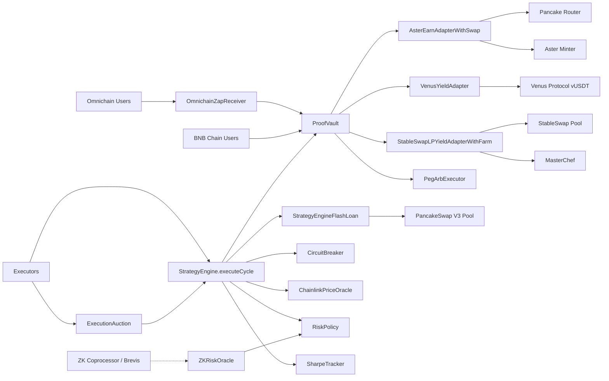
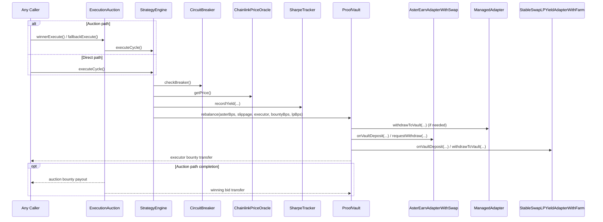

<p align="center">
  
  <br /><br />
  
  
</p>

# AsterPilot ProofVault

Autonomous, non-custodial yield routing stack on BNB Chain.

**🚀 Live dApp:** [https://asterpilot-proofvault.vercel.app](https://asterpilot-proofvault.vercel.app)

This README reflects the current deployed institutional architecture (3-rail vault + risk engine + execution auction + omnichain routing).

## What This System Is

AsterPilot ProofVault is an ERC-4626 vault that routes USDT across three rails under a permissionless execution model:

1. Primary rail: `AsterEarnAdapterWithSwap` (USDT → USDF swap, then async Aster minter integration).
2. Secondary rail (Buffer): `VenusYieldAdapter` (Idle USDT is routed to Venus Protocol vUSDT for 100% capital efficiency).
3. LP rail: `StableSwapLPYieldAdapterWithFarm` (StableSwap LP + MasterChef farm + CAKE harvest).

Core policy and safety are on-chain:

- `StrategyEngine` computes state and target allocations, utilizing `StrategyEngineFlashLoan` to execute atomic regime shifts via PancakeSwap V3 flash callbacks (eliminating idle capital and double-slippage).
- `RiskPolicy` stores immutable thresholds/targets.
- `CircuitBreaker` auto-trips/recovers from three market signals.
- `SharpeTracker` records rolling risk-adjusted performance observations.
- `ZKRiskOracle` accepts cryptographically verified off-chain Monte Carlo simulations from ZK-Coprocessors (like Brevis or Axiom) to dynamically adjust Hysteresis bands.
- `ExecutionAuction` auctions rebalance rights and forwards bid revenue/bounties.
- `OmnichainZapReceiver` allows users on any Layer 2 (Arbitrum, Base, Optimism) to bridge and deposit into the BNB Chain vault in a single transaction via LayerZero/Stargate.

## Contract Architecture (Current)

| Contract | Role |
| --- | --- |
| `ProofVault` | ERC-4626 vault, liquidity manager, and rebalance executor (`onlyEngine`) |
| `StrategyEngine` | Permissionless `executeCycle()` decision engine |
| `StrategyEngineFlashLoan` | PancakeSwap V3 flash callback for atomic capital shifts between adapters |
| `AsterEarnAdapterWithSwap` | Primary Aster rail with USDT/USDF swap and async withdraw claims |
| `VenusYieldAdapter` | Secondary rail buffer adapter integrating Venus Protocol (`vUSDT`) |
| `StableSwapLPYieldAdapterWithFarm` | LP + farm rail, permissionless CAKE harvest path |
| `RiskPolicy` | Immutable risk and allocation parameters |
| `ChainlinkPriceOracle` | Chainlink wrapper with staleness/validity checks |
| `ZKRiskOracle` | ZK-Coprocessor endpoint for off-chain verified Monte Carlo risk bounds |
| `CircuitBreaker` | Triple-signal breaker (price deviation, reserve ratio, virtual price drawdown) |
| `SharpeTracker` | Rolling yield observations + Sharpe/Sortino calculations |
| `PegArbExecutor` | Permissionless peg-arb executor returning net profit to vault |
| `ExecutionAuction` | Rebalance Rights Auction overlay for `executeCycle()` |
| `OmnichainZapReceiver` | Cross-chain intent gateway via Stargate/LayerZero |

## Mermaid: System Topology



## Mermaid: Rebalance Execution Flow



## Deployed Addresses

### Mainnet (BNB Chain, Chain ID 56)

#### Core

| Contract | Address |
| --- | --- |
| `ProofVault` | [`0xCF386Dd2c8C8356cdBF76e5c3D53B5Ef89362644`](https://bscscan.com/address/0xCF386Dd2c8C8356cdBF76e5c3D53B5Ef89362644) |
| `StrategyEngine` | [`0xb621062d6651E1D975e3134c86FA9db1fab909B7`](https://bscscan.com/address/0xb621062d6651E1D975e3134c86FA9db1fab909B7) |
| `ExecutionAuction` | [`0x147a91205d5eb67CFEEAd48a0e8b3443DE4B1e27`](https://bscscan.com/address/0x147a91205d5eb67CFEEAd48a0e8b3443DE4B1e27) |

> Other mainnet peripheral contracts (`RiskPolicy`, `CircuitBreaker`, `SharpeTracker`, adapters) are pending configuration lock. Addresses will be added here once `lockConfiguration()` is called.

#### Key Integration Addresses

- USDT: `0x55d398326f99059fF775485246999027B3197955`
- USDF: `0xc271fc70dd9e678a6a43a982f436e12d4a63c0a5`
- StableSwap Pool: `0x176f274335c8B5fD5Ec5e8274d0cf36b08E44A57`
- Pancake Router: `0x10ED43C718714eb63d5aA57B78B54704E256024E`
- MasterChef: `0x556B9306565093C855AEA9AE92A594704c2Cd59e`
- CAKE: `0x0E09FaBB73Bd3Ade0a17ECC321fD13a19e81cE82`

### Testnet (BNB Chain Testnet, Chain ID 97)

| Contract | Address |
| --- | --- |
| `ProofVault` | [`0x91484e3E37daB55e1F5345b2448d709F0F989cC0`](https://testnet.bscscan.com/address/0x91484e3E37daB55e1F5345b2448d709F0F989cC0) |
| `StrategyEngine` | [`0x01aCCB9ceADFe3dE6070e9859795A46e3B435CD1`](https://testnet.bscscan.com/address/0x01aCCB9ceADFe3dE6070e9859795A46e3B435CD1) |
| `CircuitBreaker` | [`0x267371eE32Bb873d7C604138f0a94BDF12A2e30b`](https://testnet.bscscan.com/address/0x267371eE32Bb873d7C604138f0a94BDF12A2e30b) |
| `SharpeTracker` | [`0x81CB7a859Ea779F4963Db070c09f9E698F800810`](https://testnet.bscscan.com/address/0x81CB7a859Ea779F4963Db070c09f9E698F800810) |
| `PegArbExecutor` | [`0xA69f9D03C26A19f12e02ccbD062129b6561bf2D5`](https://testnet.bscscan.com/address/0xA69f9D03C26A19f12e02ccbD062129b6561bf2D5) |
| `RiskPolicy` | [`0xfF7bdA782755B689C6511B69a478C2376451c404`](https://testnet.bscscan.com/address/0xfF7bdA782755B689C6511B69a478C2376451c404) |
| `AsterEarnAdapter` | [`0xDB5301a5Ae5621024c2f2914aDd872D39b92CFe8`](https://testnet.bscscan.com/address/0xDB5301a5Ae5621024c2f2914aDd872D39b92CFe8) |
| `VenusYieldAdapter` | [`0x91264EaC2e9298df9a83E7917c06d82Eb71567A3`](https://testnet.bscscan.com/address/0x91264EaC2e9298df9a83E7917c06d82Eb71567A3) |
| Mock USDT | [`0x71e3010Df995C1D611AbD3C5BdB198c677D6D65c`](https://testnet.bscscan.com/address/0x71e3010Df995C1D611AbD3C5BdB198c677D6D65c) |
| `ExecutionAuction` | [`0x4179E904F37746D240bF9A46c84e1d5Eb3d761fe`](https://testnet.bscscan.com/address/0x4179E904F37746D240bF9A46c84e1d5Eb3d761fe) |

## Network Mode (Feature Flag)

The frontend supports switching between mainnet and testnet via a single environment variable. **There is no UI toggle** — the network is controlled at build/deploy time.

### Switch to Testnet

```bash
# frontend/.env
VITE_DEFAULT_NETWORK=testnet
```

### Switch to Mainnet (default)

```bash
# frontend/.env
VITE_DEFAULT_NETWORK=mainnet   # or omit entirely
```

The flag is read in `frontend/lib/networkConfig.js` and propagates to all contract addresses, RPC URLs, and block explorer links automatically.

## Vault Configuration Lock

Deposits are blocked until an admin calls `lockConfiguration()` on the vault contract. This is a one-way operation that freezes the adapter/engine configuration and enables the `deposit()` function.

Until it is called, the UI will display:

> **Deposits are blocked:** vault configuration is not locked. Admin must call `lockConfiguration()` on the vault contract to enable deposits.

### How to Lock

Using Hardhat console or a deploy script:

```js
const vault = await ethers.getContractAt("ProofVault", "<vault address>");
await vault.lockConfiguration();
```

Or directly via BscScan write tab → `lockConfiguration()` (requires owner wallet).

## Recent Fixes

### `AsterEarnAdapterWithSwap` claim path

- `claimAllMatured()` is `onlyVault`.
- Matured USDF claims are swapped back to USDT.
- Swapped USDT is transferred back to vault.
- `managedAssets()` includes idle input/output balances so accounting reflects claim/swap states.

### Deposit error diagnosis

Previously the frontend showed `totalAssets() reverted` when deposits were blocked by an unlocked configuration. The frontend now correctly reads `configurationLocked` from the chain and displays an actionable message pointing to `lockConfiguration()`.

## Repo Layout

```text
contracts/
├── ProofVault.sol
├── StrategyEngine.sol
├── RiskPolicy.sol
├── ChainlinkPriceOracle.sol
├── CircuitBreaker.sol
├── SharpeTracker.sol
├── AsterEarnAdapterWithSwap.sol
├── ManagedAdapter.sol
├── StableSwapLPYieldAdapterWithFarm.sol
├── PegArbExecutor.sol
├── ExecutionAuction.sol
└── interfaces/

scripts/
├── deployFullStackWithFarm.js
├── deployExecutionAuction.js
├── deployFullStackWithLpRail.js
├── deployFullStack.js
└── ...

frontend/
├── lib/
│   ├── contractAddresses.js   ← canonical address presets (mainnet + testnet)
│   ├── networkConfig.js       ← single source of truth for network switching
│   └── wagmiConfig.js
├── hooks/
│   └── useNetworkMode.js      ← reads VITE_DEFAULT_NETWORK feature flag
└── components/
    └── ProofVaultV2Client.js
```

## Development

### Install and Test

```bash
npm install
npx hardhat compile
npx hardhat test
```

### Deploy Full Stack (Mainnet)

```bash
# requires V2_* env vars for core + farm params
npx hardhat run scripts/deployFullStackWithFarm.js --network bnb
```

### Deploy ExecutionAuction (against deployed vault/engine)

```bash
V2_ENGINE_ADDRESS=<engine> \
V2_VAULT_ADDRESS=<vault> \
V2_ASSET_ADDRESS=0x55d398326f99059fF775485246999027B3197955 \
npx hardhat run scripts/deployExecutionAuction.js --network bnb
```

### Frontend Dev

```bash
cd frontend
npm install
npm run dev
```

### Frontend Address Source

`frontend/lib/contractAddresses.js` is the canonical frontend mapping for deployed addresses. `networkConfig.js` imports these as fallback values and overlays `VITE_*` env vars on top.

## Security Posture

- Ownership is renounced after configuration lock on vault/adapters.
- Reentrancy protection on state-changing paths where required.
- Slippage checks enforced on rebalance.
- Oracle staleness and price validity checks enforced.
- Circuit breaker can block execution under stressed market signals.
