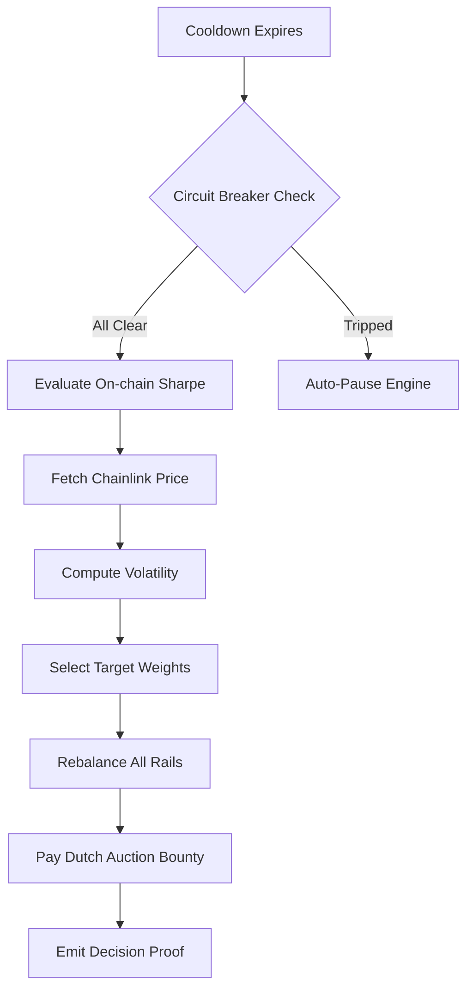

<p align="center">
  
</p>

# AsterPilot ProofVault V2: The Self-Driving Yield Engine

**Autonomous, non-custodial yield engine built on BNB Chain with AsterDEX Earn as the primary yield rail.**

> Submitted to the BNB Chain Yield Strategy Hackathon — "The Self-Driving Yield Engine".

---

## 🌪️ The Self-Driving Philosophy

### Why the System Was Designed the Way It Was

Traditional DeFi yield strategies face a fundamental tension: maximizing returns requires active risk management, but active management usually requires trusted operators—introducing "admin" risk. AsterPilot ProofVault V2 was designed to resolve this tension permanently.

The core thesis: **Every decision must be derivable from verifiable on-chain signals, executable by any address via incentives, and protected by immutable circuit breakers.** 

We made three foundational choices with deliberate intent:

1.  **3-Rail Yield Stacking** — Instead of a single strategy, we stack yields:
    *   **Primary (AsterDEX Earn):** Async, high-efficiency USDF yield.
    *   **Secondary (Managed):** Short-term flexible strategies.
    *   **LP Rail (PancakeSwap StableSwap + Farm):** Composable LP yield with auto-harvested CAKE compounding.
2.  **On-Chain Sharpe Tracking** — Total Assets behavior is recorded on-chain using a rolling window to compute **Risk-Adjusted Return**. The engine doesn't just chase APY; it measures the "quality" of that APY.
3.  **Ownerless Lifecycle** — All contracts feature a `lockConfiguration()` pattern. Once the vault and engine are wired together, the owner's key is **renounced**. The system becomes a truly autonomous public good.

### Core Strategy and Execution Logic

The strategy operates as a **three-state risk machine** driven by oracle-derived volatility and on-chain health signals:

| State | Trigger | Strategy Behavior |
| :--- | :--- | :--- |
| **Normal** | Low Volatility + Healthy Peg | Max yield: Balanced distribution across Aster, Secondary, and LP rails. |
| **Guarded** | High Volatility OR Low Sharpe | defensive: Reduce LP exposure, concentrate positions into AsterDEX Earn. |
| **Drawdown** | Extreme Volatility OR Depeg | Capital preservation: Full concentration in primary rail to protect liquidity. |

**The Autonomous Cycle (`executeCycle`):**



**What makes execution truly autonomous?** 
We've introduced the **Rebalance Rights Auction (RRA)**. Automation is no longer a cost center; it's a revenue source. Searchers bid for exclusive rights to execute the cycle, essentially paying the vault for the right to capture the MEV-aligned bounty.

### Key Assumptions Questioned or Challenged

*   **Assumption 1: "Automation requires off-chain keepers or bots."**
    *   *Challenged:* We replaced "Keepers" with **Incentive Engineering**. The Dutch Auction bounty ensures that as time passes, it becomes mathematically certain that a rational economic actor will execute the cycle to claim the reward.
*   **Assumption 2: "Security requires a manual pause button."**
    *   *Rejected:* Manual pausing requires a human to be awake and honest. We built the **Triple-Signal Circuit Breaker**:
        1.  **Price Feed:** Chainlink USDT/USD deviation.
        2.  **Reserve Ratio:** StableSwap pool balance monitoring.
        3.  **Virtual Price:** Tracking decay in LP value.
*   **Assumption 3: "Yield Aggregation is just moving money."**
    *   *Questioned:* V2 treats yield as a "Robot Route." The `AsterEarnAdapter` doesn't just deposit; it auto-swaps USDT to USDF via PancakeSwap to find the path of least resistance to the best yield.

### How the Design Prioritizes Sustainability, Resilience, and Elegance

**Sustainability (The Flywheel)**
The vault maintains an **Idle Buffer (configurable bps)**. This buffer ensures that small user withdrawals never trigger expensive LP unstacking or Aster withdrawal requests, keeping the capital "at work" longer and reducing gas drag.

**Resilience (The Hedged Posture)**
`CircuitBreaker.sol` is designed for **Autonomic Recovery**. If a depeg is detected, the engine trips. When the peg restores and the cooldown elapses, the engine can be resumed permissionlessly by anyone—no multisig voting required.

**Elegance (The Immutable Stack)**
The code is split into single-responsibility modules:
*   `ProofVaultV2.sol`: The ERC-4626 vault & asset custodian.
*   `StrategyEngineV2.sol`: The brain/decision-maker.
*   `CircuitBreaker.sol`: The immune system.
*   `SharpeTracker.sol`: The analytics engine.

---

## 🛠 Project Structure

```text
contracts/
├── ProofVaultV2.sol        # ERC-4626 Vault with 3-tier withdrawals
├── StrategyEngineV2.sol    # Autonomous decision engine
├── CircuitBreaker.sol      # Triple-signal auto-pause/recovery
├── SharpeTracker.sol       # On-chain risk-adjusted returns
├── RiskPolicyV2.sol        # Immutable risk parameters
├── AsterEarnAdapterV2...   # Primary yield rail (AsterDEX)
└── StableSwapLPYield...    # 3rd yield rail (PancakeSwap LP + Farm)
```

## 🚀 Live Deployment — BNB Chain Mainnet (Chain ID 56)

All contracts are **deployed, wired, locked, and ownership-renounced**.

### Core Stack
| Contract | Address |
| :--- | :--- |
| **ProofVaultV2** (ERC-4626 Vault) | [`0xaB4F67AfCb9B9C390049705022A0237E81465C00`](https://bscscan.com/address/0xaB4F67AfCb9B9C390049705022A0237E81465C00) |
| **StrategyEngineV2** | [`0x39085f39f1f55Aefdea8C35864dba460aCbC4c18`](https://bscscan.com/address/0x39085f39f1f55Aefdea8C35864dba460aCbC4c18) |
| **RiskPolicyV2** (Immutable params) | [`0x1CD27035829a59fEB026D986726f0Db7E110a1f1`](https://bscscan.com/address/0x1CD27035829a59fEB026D986726f0Db7E110a1f1) |
| **CircuitBreaker** (Triple-signal) | [`0xDAA5E51EEaF01895476CB2088d4093c0894079Cd`](https://bscscan.com/address/0xDAA5E51EEaF01895476CB2088d4093c0894079Cd) |
| **SharpeTracker** (On-chain risk analytics) | [`0x04247373A4d6cB929b3d81a227Bc3e45396481bB`](https://bscscan.com/address/0x04247373A4d6cB929b3d81a227Bc3e45396481bB) |
| **ChainlinkPriceOracle** | [`0x3e849369bC4BB891EB5840f0232d365f1C63e10a`](https://bscscan.com/address/0x3e849369bC4BB891EB5840f0232d365f1C63e10a) |

### Adapters & Execution
| Contract | Address |
| :--- | :--- |
| **AsterEarnAdapterV2WithSwap** (Primary rail) | [`0x5De1fEcBB3f1F8c935Ad44F5894aF24e3a2a4e24`](https://bscscan.com/address/0x5De1fEcBB3f1F8c935Ad44F5894aF24e3a2a4e24) |
| **SecondaryAdapter** | [`0xD60543EdDbee67dfD56Cbb5a35482dc77e9a24F1`](https://bscscan.com/address/0xD60543EdDbee67dfD56Cbb5a35482dc77e9a24F1) |
| **PegArbExecutor** | [`0x1c2A74Ec3bE210a8104fc61403C613513881B0bc`](https://bscscan.com/address/0x1c2A74Ec3bE210a8104fc61403C613513881B0bc) |
| **ExecutionAuction (RRA)** | [`0xD37210566698310F3620aE97151B1134bE4d352E`](https://bscscan.com/address/0xD37210566698310F3620aE97151B1134bE4d352E) |

> **Verify immutability:** All vault and adapter owners are renounced to `0x0000...0000`.  
> `cast call 0xaB4F67AfCb9B9C390049705022A0237E81465C00 "owner()(address)" --rpc-url https://bsc-dataseed.binance.org`

### Integrations
*   **Primary:** AsterDEX Earn (USDT→USDF auto-swap robot route)
*   **LP Rail:** PancakeSwap StableSwap (`0x176f274335c8B5fD5Ec5e8274d0cf36b08E44A57`)
*   **Oracle:** Chainlink USDT/USD (`0xB97Ad0E74fa7d920791E90258A6E2085088b4320`)

---

## 👨‍💻 Development

### Setup
```bash
npm install
npx hardhat compile
```

### Testing
```bash
npx hardhat test test/proof-vault-v2-integration.test.js
```

### Deployment (BNB Mainnet)
```bash
npx hardhat run scripts/deploy-v2-full-stack.js --network bnbMainnet
```


---

## Architecture

```
┌─────────────────────────────────────────────────────────────┐
│                     Anyone (permissionless)                  │
└──────────────────────────┬──────────────────────────────────┘
                           │ executeCycle()
                           ▼
┌──────────────────────────────────────────────────────────────┐
│                    StrategyEngine                            │
│  - Reads price from ChainlinkPriceOracle                     │
│  - Computes volatility vs RiskPolicy thresholds              │
│  - Selects target allocation + bounty                        │
│  - Emits DecisionProof (fully on-chain audit trail)          │
│  - Calls vault.rebalance(targetBps, slippage, executor, bps) │
│  - cycleCount++ / lastPrice = price                          │
└─────────────────┬──────────────────────────────────────────--┘
                  │ rebalance() [onlyEngine]
                  ▼
┌─────────────────────────────────────────────────────────────┐
│                 ProofVault4626 (ERC-4626)                    │
│  - _rebalanceAster()     → AsterEarnAdapter                  │
│  - _rebalanceSecondary() → ManagedAdapter                    │
│  - _payExecutorBounty()                                      │
│  - _validateAndSnapshot() [reverts on slippage]              │
└────────────┬──────────────────────┬─────────────────────────┘
             │                      │
             ▼                      ▼
┌─────────────────────┐   ┌──────────────────────────────┐
│  AsterEarnAdapter   │   │   ManagedAdapter              │
│  (AsterDEX Earn)    │   │   (Secondary rail)            │
│  selector-based     │   │   holds asUSDF — yield-       │
│  deposit/withdraw   │   │   bearing stablecoin          │
└─────────────────────┘   └──────────────────────────────┘

Oracles:
┌──────────────────────────────────┐
│  ChainlinkPriceOracle            │
│  Feed: USDT/USD (BSC mainnet)    │
│  Stale period: 2h                │
│  Normalised to 8 decimals        │
└──────────────────────────────────┘

Policy (all immutable):
┌──────────────────────────────────┐
│  RiskPolicy                      │
│  cooldown:          300s (5min)  │
│  guardedVolBps:     150 (1.5%)   │
│  drawdownVolBps:    500 (5%)     │
│  depegPrice:        $0.97        │
│  maxSlippageBps:    100 (1%)     │
│  maxBountyBps:      50 (0.5%)   │
│  normalAsterBps:    7000 (70%)   │
│  guardedAsterBps:   9000 (90%)  │
│  drawdownAsterBps:  10000 (100%) │
└──────────────────────────────────┘
```

---

## Live Deployment — BNB Mainnet (Chain ID 56)

| Contract | Address |
|----------|---------|
| ProofVault4626 | `0x721882D98194D5177F2336Bd97f50ABA44410365` |
| StrategyEngine | `0xd5ff531870c75FA29f495e70E0D406a207018D02` |
| RiskPolicy | `0x6b8776492e529fe1e33Df0Af42ffb7430F34660e` |
| ChainlinkPriceOracle | `0xD47B776e957687D1789d813eBeF79149658d00F0` |
| AsterEarnAdapter | `0x3cCcB5E20193affc9E4C1C1aa5Aee425F0FfB049` |
| SecondaryAdapter | `0x8A7cb0F7e04028EF7cb4189175B29FB370e9A4eC` |

- Vault owner: `0x0000000000000000000000000000000000000000` ✅
- All adapter owners: zero address ✅
- Oracle locked: `true` ✅
- Vault configurationLocked: `true` ✅
- Oracle feed: Chainlink USDT/USD on BSC mainnet
- Asset: asUSDF (`0x917AF46B3C3c6e1Bb7286B9F59637Fb7C65851Fb`)
- Aster minter: `0x2F31ab8950c50080E77999fa456372f276952fD8`

**Live demo frontend:** https://frontend-anhquan075s-projects.vercel.app

---

## Contracts

```
contracts/
├── ProofVault4626.sol         ERC-4626 vault, two-rail allocation, engine-only rebalance
├── StrategyEngine.sol         Risk classifier, cycle executor, DecisionProof emitter
├── RiskPolicy.sol             Immutable parameter store (all thresholds, bounties, targets)
├── AsterEarnAdapter.sol       AsterDEX Earn integration via selector-based calls
├── ManagedAdapter.sol         Generic secondary yield rail adapter
├── ChainlinkPriceOracle.sol   Chainlink AggregatorV3 wrapper with staleness check
├── interfaces/
│   ├── IManagedAdapter.sol
│   ├── IPriceOracle.sol
│   └── IChainlinkAggregator.sol
└── mocks/
    ├── MockERC20.sol
    ├── MockPriceOracle.sol
    └── MockChainlinkAggregator.sol
```

---

## Test Coverage

25 tests passing. Run with `npm test`.

Tests cover:

| Area | Tests |
|------|-------|
| Deposit + Normal cycle allocation | 1 |
| Guarded transition (medium volatility) | 1 |
| Drawdown transition (depeg event) | 1 |
| Drawdown transition (high volatility) | 1 |
| Permissionless executor bounty payout | 1 |
| Owner control disabled after lock | 1 |
| Configuration lock blocks reconfiguration | 1 |
| Cycle blocked when config not locked | 1 |
| Cooldown gate via canExecute | 1 |
| Rebalance access restricted to engine | 1 |
| Invalid oracle price rejection | 1 |
| previewDecision() deterministic output | 1 |
| Policy invariant: monotonic allocations | 1 |
| Withdraw + redeem pull from adapters | 2 |
| riskScore: calm market (score = 0) | 1 |
| riskScore: proportional volatility | 1 |
| riskScore: caps at 100 (≥20% move) | 1 |
| timeUntilNextCycle: returns 0 when ready | 1 |
| timeUntilNextCycle: positive during cooldown | 1 |
| rebalance reverts when called directly | 1 |
| Additional policy/edge cases | 4 |

---

## Setup

```bash
npm install
cp .env.example .env
# Fill in .env: BNB_MAINNET_RPC_URL, PRIVATE_KEY, ASTER_*, ORACLE_MODE, CHAINLINK_FEED_ADDRESS
```

## Commands

```bash
npm run compile              # Compile all Solidity contracts
npm test                     # Run all 25 tests
npm run deploy:aster:stack   # Deploy full stack to BNB mainnet
```

## Version Switching (V1/V2)

The frontend supports switching between V1 and V2 vault implementations via environment variable.

### Quick Start

```bash
# Use V2 (default)
VITE_VAULT_VERSION=v2 npm run dev

# Use V1
VITE_VAULT_VERSION=v1 npm run dev
```

### Configuration

Set in `.env.local`:

```bash
VITE_VAULT_VERSION=v2  # or v1
```

### Architecture

```
frontend/
├── components/
│   ├── v1/              # V1-specific components
│   │   └── ProofVaultV1Client.js
│   ├── v2/              # V2-specific components
│   │   └── ProofVaultV2Client.js
│   └── shared/          # Shared components
│       ├── ui/
│       └── cards/
├── hooks/
│   ├── v1/              # V1 hooks
│   ├── v2/              # V2 hooks
│   └── shared/          # Shared hooks
└── lib/
    ├── v1-config.js    # V1 contract addresses
    ├── v2-contract-addresses.js  # V2 contract addresses
    └── version-config.js  # Version feature flag
```

### V1 vs V2 Differences

**V1 Features**:
- Core vault (ProofVault4626)
- Strategy engine with risk states
- Two-rail allocation (AsterDEX Earn + Secondary)

**V2 Additions**:
- Circuit Breaker (three-signal risk monitoring)
- Sharpe Ratio tracker (yield quality metrics)
- Dutch Auction bounty system
- Peg Arbitrage executor

### Contract Addresses

**V1 (BNB Mainnet)**:
- Vault: `0x721882D98194D5177F2336Bd97f50ABA44410365`
- Engine: `0xd5ff531870c75FA29f495e70E0D406a207018D02`

**V2 (BNB Mainnet)**:
- Vault: `0xaB4F67AfCb9B9C390049705022A0237E81465C00`
- Engine: `0x39085f39f1f55Aefdea8C35864dba460aCbC4c18`
- Circuit Breaker: `0xDAA5E51EEaF01895476CB2088d4093c0894079Cd`
- Sharpe Tracker: `0x04247373A4d6cB929b3d81a227Bc3e45396481bB`
- Peg Arb Executor: `0x1c2A74Ec3bE210a8104fc61403C613513881B0bc`

## Frontend

```bash
cd frontend
npm install
npm run dev       # Local dev
npm run build     # Production build check
npx vercel --prod # Deploy to Vercel
```

---

## AsterDEX Earn Integration

The `AsterEarnAdapter` integrates with AsterDEX Earn using three configurable function selectors:

| Selector | Purpose |
|----------|---------|
| `0x0eb78661` | Deposit assets into Aster Earn |
| `0xeb5188db` | Withdraw assets from Aster Earn |
| `0x7e1c0c09` | Query current managed balance |

This selector-based approach avoids ABI import fragility. If AsterDEX updates their interface, only the deployment parameters change — no contract code needs to be rewritten. The minter (`0x2F31ab8950c50080E77999fa456372f276952fD8`) is the live AsterDEX Earn contract on BNB mainnet.

Approval handling: the adapter uses `forceApprove(minter, 0)` → `forceApprove(minter, amount)` → call → `forceApprove(minter, 0)`, preventing stale allowances and following the SafeERC20 best practice for tokens that require approval to be reset before increasing.

---

## Security Properties

| Property | Implementation |
|----------|---------------|
| Non-custodial | `lockConfiguration()` calls `renounceOwnership()` — owner address zeroed permanently |
| No upgradeability | No proxy pattern, no `delegatecall`, no implementation slot |
| Reentrancy protection | `ReentrancyGuard` on all state-changing vault operations |
| Oracle manipulation resistance | Chainlink multi-source aggregator, not AMM LP ratio |
| Stale price rejection | Configurable `stalePeriod` — defaults to 7200s |
| Slippage enforcement | Post-rebalance allocation drift validated before call returns |
| Flash-loan safe shares | `_decimalsOffset() = 6` for virtual share inflation |
| Monotonic allocation | Constructor rejects policies where higher risk → lower Aster allocation |
| Bounded bounty | `maxBountyBps ≤ 200` enforced in both RiskPolicy and rebalance() |

---

## Four Pillars — Compliance Evidence

### I. Integrate — AsterDEX Earn as primary yield source and execution engine
- `AsterEarnAdapter` wraps AsterDEX Earn using selector-based calls (`0x0eb78661` deposit, `0xeb5188db` withdraw, `0x7e1c0c09` balance)
- All rebalancing targets Aster allocation first: Normal 70%, Guarded 90%, Drawdown 100%
- Chainlink USDT/USD oracle (not AMM LP) drives every allocation decision — flash-loan resistant
- Live: `AsterEarnAdapter` at `0x6056b2b06665C496E86C0F4d1a3a866aB55265b0`, Aster minter at `0x2F31ab8950c50080E77999fa456372f276952fD8`

### II. Stack — Composable yield stacking
- Dual-rail architecture: primary (AsterDEX Earn) + secondary (asUSDF capital buffer)
- asUSDF is a yield-bearing stablecoin — secondary rail earns native protocol yield passively while idle
- IManagedAdapter interface is composable: any conforming adapter (PancakeSwap LP, farm, lending protocol) slots in without touching vault or engine
- During Normal state: 70% AsterDEX Earn + 30% asUSDF = dual yield sources active simultaneously
- Excess from Aster rebalances flows directly into secondary rail (`_rebalanceAster` → `secondaryAdapter.onVaultDeposit`)

### III. Automate — Fully programmatic and deterministic
- `executeCycle()` is **permissionless** — any EOA or contract may call it
- **No off-chain keepers, no Chainlink Automation, no cron jobs, no backend** required
- Bounty mechanism creates pure on-chain economic incentive (Normal: 0.25% AUM, Guarded: 0.375%, Drawdown: 0.5%)
- Cooldown enforced on-chain via `policy.cooldown()` (300s) — no state mutation possible during cooldown
- `previewDecision()` lets anyone verify the exact next action before triggering execution
- `DecisionProof` event emitted every cycle — fully auditable on-chain decision trace

### IV. Protect — 100% non-custodial, fully decentralised
- `lockConfiguration()` permanently calls `renounceOwnership()` — owner key zeroed forever
- Vault owner: `0x0000000000000000000000000000000000000000`
- No emergency pause, no admin withdrawal, no parameter override possible
- All parameters immutable post-deploy (RiskPolicy is a pure parameter store with no setters)
- ReentrancyGuard on all state-changing vault operations
- Post-rebalance slippage validation reverts the entire cycle if allocation drifts beyond `maxSlippageBps`

---

## Design Prompts — Response

### Hedging
AsterDEX Earn serves a dual role: in **Drawdown state**, 100% allocation to Aster Earn is itself a hedging posture. Rather than maintaining LP positions that would suffer impermanent loss and complex unwind costs during a depeg or high-volatility event, the vault concentrates fully in the most liquid, transparent primary rail. The secondary asUSDF position is exited first (protecting the primary), which prevents forced liquidation of the Aster position under stress. The result: the vault uses Aster Earn as the safe harbour that secondary positions hedge towards during market stress.

### Volatility
The engine converts volatility into **bounty urgency**. The higher the detected volatility, the larger the executor bounty (up to 0.5% of AUM at Drawdown). This means the exact moment volatility spikes — when rebalancing is most critical — is also the moment executing `executeCycle()` is most profitable for any caller. Volatility becomes a self-tightening execution trigger: the worse the market, the faster the system responds, with zero latency between eligibility and execution.

### Resilience
During Drawdown (volatility ≥ 5% OR price < $0.97):
- 100% capital moves to AsterDEX Earn (most liquid, most transparent)
- Secondary position fully unwound, eliminating LP slippage and complex exit risk
- `_ensureLiquid()` always pulls secondary before Aster during withdrawals — user redemptions never force disruption of the primary position
- Post-rebalance slippage check reverts the cycle if execution produces unexpected drift
- Stale oracle price (>2h) blocks execution — the engine never acts on bad data

---

## Eligibility Checklist

- [x] Built on BNB Chain (deployed to mainnet, chain ID 56)
- [x] AsterDEX Earn as primary yield engine (`AsterEarnAdapter` with live minter)
- [x] Fully autonomous (`executeCycle()` permissionless, bounty-incentivised)
- [x] Non-custodial (all owner keys zeroed post-deployment)
- [x] Decentralised (no privileged execution paths, no multisig)
- [x] No manual execution required
- [x] No off-chain automation required
- [x] No multisig control

---

## Submission Requirements

### The Code
- Private GitHub repository with clear commit history and structured PRs
- Repository access: **cryptocoder0x** and **tggeth**

### The Demo
- 3-minute demo video showing autonomous cycle execution, risk state transitions, and DecisionProof events
- Demonstrates: load preset → connect → refresh state → execute cycle → verify on BscScan
- Live frontend: https://frontend-anhquan075s-projects.vercel.app

### The Philosophy of Design
See [Philosophy of Design](#the-philosophy-of-design) section above.

---

## Notes

- `StrategyEngine` has no owner address. It is a pure stateless logic contract after deployment.
- The secondary adapter (`ManagedAdapter`) holds **asUSDF** — the AsterDEX native yield-bearing stablecoin. Holding asUSDF is not idle: asUSDF accrues protocol fees and yield continuously, making the secondary rail a passive yield source even without an active DeFi strategy. This is a deliberate architectural choice: the secondary slot is a composable adapter interface. Any `IManagedAdapter`-conforming contract (PancakeSwap LP, lending protocol, farm) can serve as the secondary rail in a fresh deployment without touching the vault or engine. The current implementation prioritises trust-minimization and simplicity — no external protocol dependencies that could introduce unaudited systemic risk into the secondary position.
- `previewDecision()` is a deterministic view function — it returns exactly what `executeCycle()` would do, enabling anyone to predict and verify the outcome before triggering execution.
