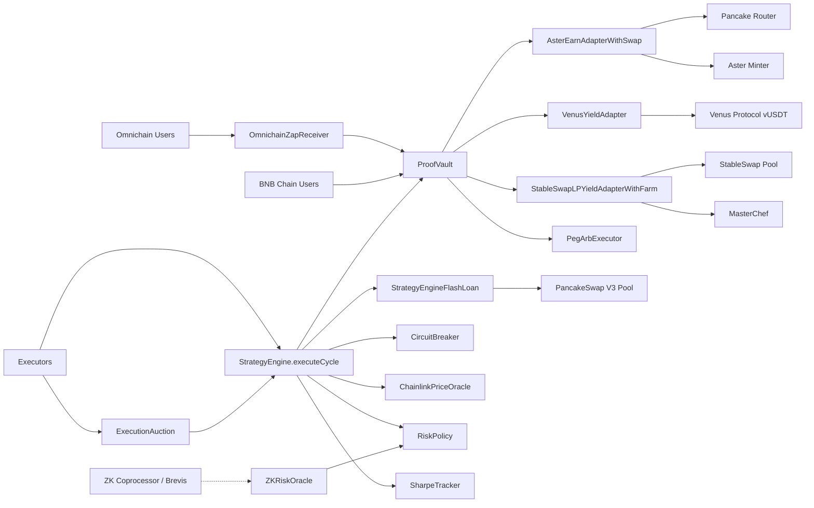
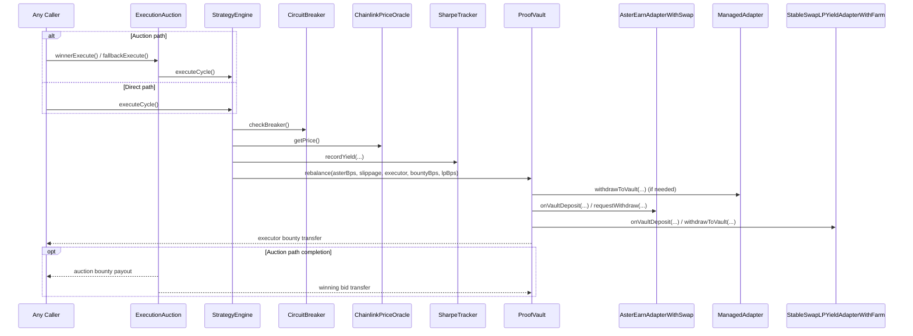

<p align="center">
  
  <br /><br />
  
  
</p>

# AsterPilot ProofVault

Autonomous, non-custodial yield routing stack on BNB Chain.

**🚀 Live dApp:** [https://asterpilot-proofvault.vercel.app](https://asterpilot-proofvault.vercel.app)

This README reflects the current deployed institutional architecture (3-rail vault + risk engine + execution auction + omnichain routing).

## Philosophy of Design

### Why this system was designed this way

The core insight behind AsterPilot ProofVault is that human capital managers fail at exactly the moments when precision matters most: during volatility spikes, peg deviations, and liquidity crunches. They sleep, they hesitate, and they pay for the privilege of being slow. This system removes the human from the loop entirely — not as a convenience feature, but as a first principle.

The design starts from a simple question: **if the smart contract is always awake, always deterministic, and can see every on-chain signal, why would you ever trust a human to press a button?**

### Core strategy and execution logic

The system operates as a three-rail capital routing engine governed by a risk state machine:

**Rail 1 — AsterDEX Earn (Primary):** USDT is swapped to USDF and deposited into AsterDEX Earn as the primary yield source and capital anchor. In distress conditions, allocation to Aster _increases_ (from `normalAsterBps` to `drawdownAsterBps`) because AsterDEX Earn is the most stable, protocol-native yield source when external LP markets are stressed.

**Rail 2 — Venus Protocol (Idle Buffer):** Capital not actively deployed earns passive yield via Venus vUSDT. There is no idle capital — even the buffer works. This is not a fallback; it is the baseline.

**Rail 3 — PancakeSwap StableSwap LP + MasterChef (Growth):** LP allocation is highest in `Normal` state and retreats to zero in `Drawdown`. CAKE rewards are auto-harvested and compounded back into the vault. The LP rail is the first to be unwound under stress, protecting principal while keeping yield flowing.

**Risk state machine:** The engine computes EWMA (exponentially-weighted moving average) volatility each cycle, classifies market conditions into three states (Normal / Guarded / Drawdown), and adjusts all three rail allocations atomically. Hysteresis bands prevent regime thrashing on marginal price movements.

**Execution model:** `executeCycle()` is fully permissionless — any address can call it. A Dutch auction bounty mechanism (linear escalation from `minBountyBps` to `maxBountyBps`) creates a MEV-like incentive structure so that competitive searchers time execution optimally without the vault paying a flat fee. In the `ExecutionAuction` overlay, this flips further: searchers _pay_ the vault for execution rights, converting automation from a cost center into a revenue source.

**Flash loan regime shifts:** When risk state changes (e.g., Normal → Drawdown), capital must shift between adapters without leaving funds idle during the transition. `executeCycleWithFlashRebalance()` uses a PancakeSwap V3 flash callback to atomically deposit into the target adapter, pull from the source, and repay the flash pool in a single transaction — eliminating double-slippage and idle capital window.

**Peg arbitrage:** `PegArbExecutor` monitors the USDF/USDT pool for peg deviation and executes atomic arb (buy cheap USDF → redeem at par, or mint USDF at par → sell expensive) returning net profit to the vault. This turns a systemic risk (USDF depeg) into a vault revenue event.

### Key assumptions that were questioned or challenged

1. **"Rebalancers should be compensated by the vault."** We inverted this. In the `ExecutionAuction` model, rebalancers _pay_ for execution rights because they capture MEV from optimal block timing. The vault benefits, not just the executor.

2. **"A circuit breaker needs an admin to trip and reset it."** Ours is fully autonomous — it trips on any single signal (Chainlink USDT/USD deviation, StableSwap reserve ratio imbalance, virtual price drawdown) and recovers automatically after a cooldown when all signals clear. No multisig, no call required.

3. **"Higher volatility = lower Aster allocation."** We challenged this. Under drawdown conditions, Aster allocation _increases_ because it is the most protocol-native, stable yield primitive. LP exposure (the most volatile) is reduced to near-zero. AsterDEX Earn functions as a hedge, not just a yield source.

4. **"Sharpe ratio requires off-chain analytics."** We compute rolling Sharpe and Sortino ratios on-chain using a circular buffer (O(1) writes), Bessel-corrected sample variance, and Babylonian integer square root — all in Solidity 0.8.24. No oracle needed.

5. **"Non-custodial means no admin can do anything."** Correct — after `lockConfiguration()` is called, ownership is irrevocably renounced on every contract that touches user funds. `RiskPolicy` has no owner at all — all parameters are `immutable`. The system is governed by code, not keys.

### How the design prioritizes sustainability, resilience, and elegance

**Sustainability:** The bounty model is designed to be self-funding. Peg arb profits, CAKE harvest yields, and auction bid revenue all flow back to the vault's TVL, compounding returns for depositors without external subsidy.

**Resilience:** The three-tier liquidity waterfall (idle → Venus → LP → Aster claims) ensures withdrawals can always be serviced. The circuit breaker halts rebalancing under three independent market stress signals — any one is sufficient to pause — and recovers automatically when all clear. The flash-loan block guard prevents same-block deposit/withdraw sandwich attacks.

**Elegance:** Every configurable parameter is set once at construction and frozen. No governance tokens, no upgrade proxies, no timelock. The architecture is intentionally minimal: once deployed and locked, it runs indefinitely with zero privileged intervention. The system's correctness can be verified entirely from its immutable bytecode.

> **Note on ZKRiskOracle:** The `ZKRiskOracle` contract is an architectural integration point for ZK coprocessors (e.g., Brevis/Axiom) to submit cryptographically-verified Monte Carlo risk computations on-chain. In the current deployment, the oracle stores verified metrics and its data can be read by external keepers or future engine upgrades. The core `StrategyEngine` operates deterministically from on-chain signals and does not depend on ZKRiskOracle for its current execution path — ensuring liveness even if the ZK coprocessor is unavailable.

---

## What This System Is

AsterPilot ProofVault is an ERC-4626 vault that routes USDT across three rails under a permissionless execution model:

1. Primary rail: `AsterEarnAdapterWithSwap` (USDT → USDF swap, then async Aster minter integration).
2. Secondary rail (Buffer): `VenusYieldAdapter` (Idle USDT is routed to Venus Protocol vUSDT for 100% capital efficiency).
3. LP rail: `StableSwapLPYieldAdapterWithFarm` (StableSwap LP + MasterChef farm + CAKE harvest).

Core policy and safety are on-chain:

- `StrategyEngine` computes state and target allocations, utilizing `StrategyEngineFlashLoan` to execute atomic regime shifts via PancakeSwap V3 flash callbacks (eliminating idle capital and double-slippage).
- `RiskPolicy` stores immutable thresholds/targets.
- `CircuitBreaker` auto-trips/recovers from three market signals.
- `SharpeTracker` records rolling risk-adjusted performance observations.
- `ZKRiskOracle` accepts cryptographically verified off-chain Monte Carlo simulations from ZK-Coprocessors (like Brevis or Axiom) to dynamically adjust Hysteresis bands.
- `ExecutionAuction` auctions rebalance rights and forwards bid revenue/bounties.
- `OmnichainZapReceiver` allows users on any Layer 2 (Arbitrum, Base, Optimism) to bridge and deposit into the BNB Chain vault in a single transaction via LayerZero/Stargate.

## Contract Architecture (Current)

| Contract                           | Role                                                                           |
| ---------------------------------- | ------------------------------------------------------------------------------ |
| `ProofVault`                       | ERC-4626 vault, liquidity manager, and rebalance executor (`onlyEngine`)       |
| `StrategyEngine`                   | Permissionless `executeCycle()` decision engine                                |
| `StrategyEngineFlashLoan`          | PancakeSwap V3 flash callback for atomic capital shifts between adapters       |
| `AsterEarnAdapterWithSwap`         | Primary Aster rail with USDT/USDF swap and async withdraw claims               |
| `VenusYieldAdapter`                | Secondary rail buffer adapter integrating Venus Protocol (`vUSDT`)             |
| `StableSwapLPYieldAdapterWithFarm` | LP + farm rail, permissionless CAKE harvest path                               |
| `RiskPolicy`                       | Immutable risk and allocation parameters                                       |
| `ChainlinkPriceOracle`             | Chainlink wrapper with staleness/validity checks                               |
| `ZKRiskOracle`                     | ZK-Coprocessor endpoint for off-chain verified Monte Carlo risk bounds         |
| `CircuitBreaker`                   | Triple-signal breaker (price deviation, reserve ratio, virtual price drawdown) |
| `SharpeTracker`                    | Rolling yield observations + Sharpe/Sortino calculations                       |
| `PegArbExecutor`                   | Permissionless peg-arb executor returning net profit to vault                  |
| `ExecutionAuction`                 | Rebalance Rights Auction overlay for `executeCycle()`                          |
| `OmnichainZapReceiver`             | Cross-chain intent gateway via Stargate/LayerZero                              |

## Mermaid: System Topology



## Mermaid: Rebalance Execution Flow



## Deployed Addresses

### Mainnet (BNB Chain, Chain ID 56)

#### Core

| Contract           | Address                                                                                                                |
| ------------------ | ---------------------------------------------------------------------------------------------------------------------- |
| `ProofVault`       | [`0xCF386Dd2c8C8356cdBF76e5c3D53B5Ef89362644`](https://bscscan.com/address/0xCF386Dd2c8C8356cdBF76e5c3D53B5Ef89362644) |
| `StrategyEngine`   | [`0xb621062d6651E1D975e3134c86FA9db1fab909B7`](https://bscscan.com/address/0xb621062d6651E1D975e3134c86FA9db1fab909B7) |
| `ExecutionAuction` | [`0x147a91205d5eb67CFEEAd48a0e8b3443DE4B1e27`](https://bscscan.com/address/0x147a91205d5eb67CFEEAd48a0e8b3443DE4B1e27) |

> Other mainnet peripheral contracts (`RiskPolicy`, `CircuitBreaker`, `SharpeTracker`, adapters) are pending configuration lock. Addresses will be added here once `lockConfiguration()` is called.

#### Key Integration Addresses

- USDT: `0x55d398326f99059fF775485246999027B3197955`
- USDF: `0xc271fc70dd9e678a6a43a982f436e12d4a63c0a5`
- StableSwap Pool: `0x176f274335c8B5fD5Ec5e8274d0cf36b08E44A57`
- Pancake Router: `0x10ED43C718714eb63d5aA57B78B54704E256024E`
- MasterChef: `0x556B9306565093C855AEA9AE92A594704c2Cd59e`
- CAKE: `0x0E09FaBB73Bd3Ade0a17ECC321fD13a19e81cE82`

### Testnet (BNB Chain Testnet, Chain ID 97)

| Contract                           | Address                                                                                                                        |
| ---------------------------------- | ------------------------------------------------------------------------------------------------------------------------------ |
| `ProofVault`                       | [`0xf953624C4b2EB2300454EdaC9B548879F6cFEeB6`](https://testnet.bscscan.com/address/0xf953624C4b2EB2300454EdaC9B548879F6cFEeB6) |
| `StrategyEngine`                   | [`0x6fC173849E6a993292F538cA48eB4fd00c3605e5`](https://testnet.bscscan.com/address/0x6fC173849E6a993292F538cA48eB4fd00c3605e5) |
| `RiskPolicy`                       | [`0xDB16526616a12ED2d0Cb7bfa5681929Fd1e97211`](https://testnet.bscscan.com/address/0xDB16526616a12ED2d0Cb7bfa5681929Fd1e97211) |
| `CircuitBreaker`                   | [`0xCD58f14320e827E388AeA50Bb48b8E4c1eE48de0`](https://testnet.bscscan.com/address/0xCD58f14320e827E388AeA50Bb48b8E4c1eE48de0) |
| `SharpeTracker`                    | [`0xE9d9c3564a8dC75c553390f15f7Fbb7a81531BD0`](https://testnet.bscscan.com/address/0xE9d9c3564a8dC75c553390f15f7Fbb7a81531BD0) |
| `AsterEarnAdapterWithSwap`         | [`0x3d5795ad0f1b160B751ac2a00Cf451c57bb210D8`](https://testnet.bscscan.com/address/0x3d5795ad0f1b160B751ac2a00Cf451c57bb210D8) |
| `ManagedAdapter` (secondary)       | [`0x5d31f59bE9131B8d884de1c9E2035A9767933881`](https://testnet.bscscan.com/address/0x5d31f59bE9131B8d884de1c9E2035A9767933881) |
| `StableSwapLPYieldAdapterWithFarm` | [`0x916e3E5225bF6bcf2533343F088921cddC625acd`](https://testnet.bscscan.com/address/0x916e3E5225bF6bcf2533343F088921cddC625acd) |
| `PegArbExecutor`                   | [`0x6D9C5EE63d8a4eea6E0f6354f38F14525D169be5`](https://testnet.bscscan.com/address/0x6D9C5EE63d8a4eea6E0f6354f38F14525D169be5) |
| `ExecutionAuction`                 | [`0x800BCDa679e8D458248D4342D8DD53253CC2ffBE`](https://testnet.bscscan.com/address/0x800BCDa679e8D458248D4342D8DD53253CC2ffBE) |
| Mock USDT                          | [`0x65079A226a23f3F7786aa7FB231f84FB81CB43B3`](https://testnet.bscscan.com/address/0x65079A226a23f3F7786aa7FB231f84FB81CB43B3) |

## Network Mode (Feature Flag)

The frontend supports switching between mainnet and testnet via a single environment variable. **There is no UI toggle** — the network is controlled at build/deploy time.

### Switch to Testnet

```bash
# frontend/.env
VITE_DEFAULT_NETWORK=testnet
```

### Switch to Mainnet (default)

```bash
# frontend/.env
VITE_DEFAULT_NETWORK=mainnet   # or omit entirely
```

The flag is read in `frontend/lib/networkConfig.js` and propagates to all contract addresses, RPC URLs, and block explorer links automatically.

## Vault Configuration Lock

Deposits are blocked until an admin calls `lockConfiguration()` on the vault contract. This is a one-way operation that freezes the adapter/engine configuration and enables the `deposit()` function.

Until it is called, the UI will display:

> **Deposits are blocked:** vault configuration is not locked. Admin must call `lockConfiguration()` on the vault contract to enable deposits.

### How to Lock

Using Hardhat console or a deploy script:

```js
const vault = await ethers.getContractAt("ProofVault", "<vault address>");
await vault.lockConfiguration();
```

Or directly via BscScan write tab → `lockConfiguration()` (requires owner wallet).

## Recent Fixes

### `AsterEarnAdapterWithSwap` claim path

- `claimAllMatured()` is `onlyVault`.
- Matured USDF claims are swapped back to USDT.
- Swapped USDT is transferred back to vault.
- `managedAssets()` includes idle input/output balances so accounting reflects claim/swap states.

### Deposit error diagnosis

Previously the frontend showed `totalAssets() reverted` when deposits were blocked by an unlocked configuration. The frontend now correctly reads `configurationLocked` from the chain and displays an actionable message pointing to `lockConfiguration()`.

## Repo Layout

```text
contracts/
├── ProofVault.sol
├── StrategyEngine.sol
├── RiskPolicy.sol
├── ChainlinkPriceOracle.sol
├── CircuitBreaker.sol
├── SharpeTracker.sol
├── AsterEarnAdapterWithSwap.sol
├── ManagedAdapter.sol
├── StableSwapLPYieldAdapterWithFarm.sol
├── PegArbExecutor.sol
├── ExecutionAuction.sol
└── interfaces/

scripts/
├── deployFullStackWithFarm.js
├── deployExecutionAuction.js
├── deployFullStackWithLpRail.js
├── deployFullStack.js
└── ...

frontend/
├── lib/
│   ├── contractAddresses.js   ← canonical address presets (mainnet + testnet)
│   ├── networkConfig.js       ← single source of truth for network switching
│   └── wagmiConfig.js
├── hooks/
│   └── useNetworkMode.js      ← reads VITE_DEFAULT_NETWORK feature flag
└── components/
    └── ProofVaultV2Client.js
```

## Development

### Install and Test

```bash
npm install
npx hardhat compile
npx hardhat test
```

### Deploy Full Stack (Mainnet)

```bash
# requires V2_* env vars for core + farm params
npx hardhat run scripts/deployFullStackWithFarm.js --network bnb
```

### Deploy ExecutionAuction (against deployed vault/engine)

```bash
V2_ENGINE_ADDRESS=<engine> \
V2_VAULT_ADDRESS=<vault> \
V2_ASSET_ADDRESS=0x55d398326f99059fF775485246999027B3197955 \
npx hardhat run scripts/deployExecutionAuction.js --network bnb
```

### Frontend Dev

```bash
cd frontend
npm install
npm run dev
```

### Frontend Address Source

`frontend/lib/contractAddresses.js` is the canonical frontend mapping for deployed addresses. `networkConfig.js` imports these as fallback values and overlays `VITE_*` env vars on top.

## Security Posture

- Ownership is renounced after configuration lock on vault/adapters.
- Reentrancy protection on state-changing paths where required.
- Slippage checks enforced on rebalance.
- Oracle staleness and price validity checks enforced.
- Circuit breaker can block execution under stressed market signals.
