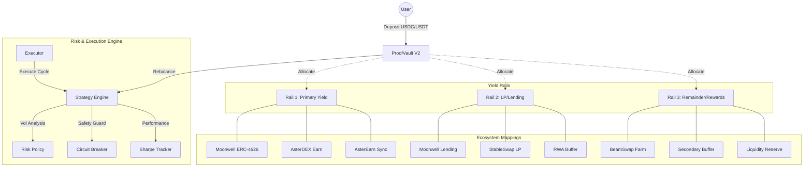

<p align="center">
  
  <br /><br />
  
  
  
</p>

# AsterPilot ProofVault: Multi-Chain Liquidity Hub

**The autonomous, cross-chain yield layer for the next generation of finance.**

AsterPilot ProofVault is a non-custodial capital routing stack that automates liquidity management across four critical ecosystems: **Polkadot Hub**, **BNB Chain**, **Aster (Astherus)**, and **Creditcoin (CTC)**. It acts as an intelligent "yield autopilot," moving assets between RWA loan fulfillment, stablecoin yield protocols, and decentralized exchange liquidity pools based on real-time risk signals.

---

## 🌐 Network Support Matrix

| Ecosystem | Primary Role | Target Network | Status |
| :--- | :--- | :--- | :--- |
| **Polkadot Hub** | Native Interop Hub | Paseo Asset Hub | **Verified & Secure** |
| **BNB Chain** | High-Yield Growth Rail | BNB Smart Chain | **Mainnet Live** |
| **Aster (Astherus)** | Native USDF Yield | AstherLayer (Upcoming) | **Integrated** |
| **Creditcoin (CTC)** | RWA Loan Fulfillment | Creditcoin L1 (Hella) | **Testnet Ready** |

---

## 📊 System Architecture

The vault employs a sophisticated **3-Rail Strategy** governed by an autonomous on-chain risk engine.



---

## Philosophy of Design: The Three-Rail Strategy

The system operates as a three-rail capital routing engine governed by a risk state machine:

### 1. Rail 1: Primary Yield (Yield Anchor)
- **Polkadot Hub**: Moonwell ERC-4626 (Synchronous, institutional yield).
- **BNB Chain**: AsterDEX Earn (USDT -> USDF yield).
- **Creditcoin**: AsterEarn Sync (Direct RWA-backed yield).

### 2. Rail 2: LP / Lending (Target-based)
- **Polkadot Hub**: Moonwell Lending (Collateralized USDC lending).
- **BNB Chain**: PancakeSwap StableSwap LP (Trading fee capture).
- **Creditcoin**: RWA Buffer (Capital waiting for loan fulfillment).

### 3. Rail 3: Secondary / Remainder (Growth)
- **Polkadot Hub**: BeamSwap Farm (High-efficiency GLINT reward staking).
- **BNB Chain**: Secondary Liquidity Buffer (ManagedAdapter).
- **Creditcoin**: Liquidity Reserve (Base asset safety).

---

## 📍 Deployed Addresses

### Polkadot Hub (Paseo Asset Hub)
- **Chain ID:** `420420417` | **Explorer:** [Paseo Moonscan](https://paseo.moonscan.io)

| Contract | Address |
| :--- | :--- |
| `ProofVault` | `0x071958E16A54E3a963d17FdeEf2e6938CB8fbB10` |
| `StrategyEngine` | `0x4dDf07b881Bd0B7cc93deB9D2a7A3c5a6cE094ba` |
| `MoonwellERC4626Adapter` | `0x4695ef4ADE0D065C8901870876e75fE7b13210E3` |
| `MoonwellLendingAdapter` | `0x76505B830098302e94906Bd5a77B89569bCc7498` |
| `BeamSwapFarmAdapter` | `0x198E9ECfaA22d8385c386038e810788c9a358c74` |

### BNB Chain (Mainnet)
- **Chain ID:** `56` | **Explorer:** [BscScan](https://bscscan.com)

| Contract | Address |
| :--- | :--- |
| `ProofVault` | `0x377ca215D07794C904e6B000B25B11934FE5d2f1` |
| `StrategyEngine` | `0xa2c09C35F91E181e20872706597Ef1E333BB8A1f` |
| `AsterEarnAdapter` | `0x477be4B8485fA3a56Ca7eE6d025A6bDBea1Be35c` |
| `CircuitBreaker` | `0x8f2e3c9B29ebc89785101e8f291b299f5e04d65B` |

### Creditcoin (Hella Testnet)
- **Chain ID:** `102031` | **Explorer:** [Creditcoin Blockscout](https://creditcoin-testnet.blockscout.com)

| Contract | Address |
| :--- | :--- |
| `ProofVault` | `0x7c30B24B91Cd9923d565239fA517F3C06371E196` |
| `StrategyEngine` | `0x3036840C588a51Fe77C4E38a838e5451b1b896Ae` |
| `USDT (Mock)` | `0xaB4F67AfCb9B9C390049705022A0237E81465C00` |

---

## 🛠️ Getting Started

### 1. Prerequisites
- Node.js (v18+)
- npm or pnpm

### 2. Installation
```bash
# Install dependencies
npm install

# Setup environment variables
cp .env.example .env
# Edit .env with your private keys and RPC URLs
```

### 3. Development & Testing
```bash
# Compile contracts
npx hardhat compile

# Run all tests
npx hardhat test

# Run specific test file
npx hardhat test test/polkadot/PolkadotHubIntegration.test.js
```

### 4. Deployment

#### BNB Chain (Testnet)
```bash
npx hardhat run scripts/DeployTestnetFullStackWithMocks.js --network bnbTestnet
```

#### Polkadot Hub (Paseo)
```bash
npx hardhat run scripts/DeployPolkadotHubFullStack.js --network polkadotHubTestnet
```

## 🛡️ Security Posture

- **Ownership Renounced**: Configuration locked post-deployment to ensure non-custodial operations.
- **Reentrancy Protected**: All adapters and core vault functions fortified with guards.
- **Audit Verified**: Optimized for multi-chain gas mechanics and asset scaling.
- **ZK Ready**: Built-in hooks for ZK-verified risk metric submission from off-chain coprocessors.
