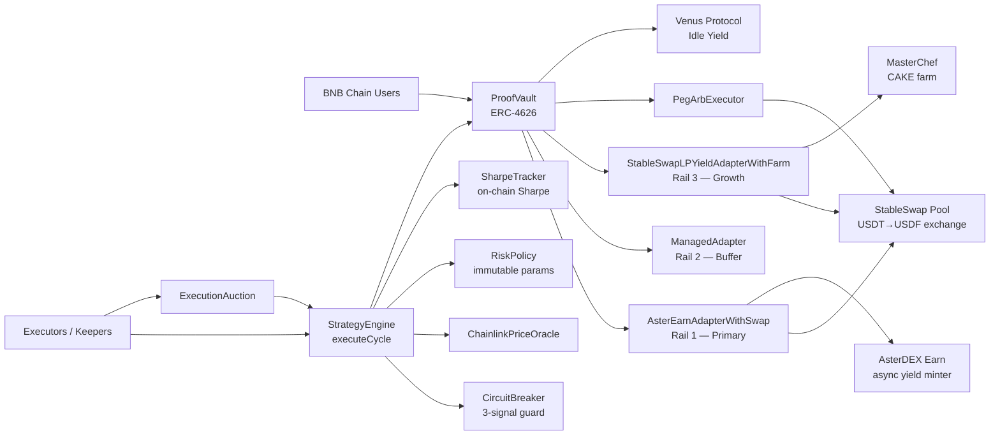

<p align="center">
  
  <br /><br />
    
  
  
</p>

# AsterPilot ProofVault: Multi-Chain Liquidity Hub

**The autonomous, cross-chain yield layer for the next generation of finance.**

AsterPilot ProofVault is a non-custodial capital routing stack that automates liquidity management across three critical ecosystems: **BNB Chain**, **Aster (Astherus)**, and **Creditcoin (CTC)**. It acts as an intelligent "yield autopilot," moving assets between RWA loan fulfillment, stablecoin yield protocols, and decentralized exchange liquidity pools based on real-time risk signals.

---

## 🌐 Network Support Matrix

| Ecosystem | Primary Role | Target Network | Status |
| :--- | :--- | :--- | :--- |
| **BNB Chain** | High-Yield Growth Rail | BNB Smart Chain | **Mainnet Live** |
| **Aster (Astherus)** | Native USDF/AsterDEX Yield | AstherLayer (Upcoming) / BSC | **Integrated** |
| **Creditcoin (CTC)** | RWA Loan Fulfillment | Creditcoin L1 (Hella) | **Testnet Ready** |

---

## 🏆 BUIDL CTC Hackathon 2026

This project is submitted to the **BUIDL CTC Hackathon**, showcasing a production-ready institutional vault that bridges Creditcoin's RWA assets with the broader liquidity of the BNB and Aster ecosystems.

### Track Alignment:
1.  **DeFi Track (Creditcoin):** Provides a scalable, general-purpose L1 yield engine that automates liquidity provision and trading, proving Creditcoin's reliability for on-chain finance.
2.  **RWA Track (Aster/Creditcoin):** ProofVault functions as the **automated liquidity partner** for RWA loan cycles. It autonomously deploys capital into Creditcoin's loan opportunities and Aster's stablecoin rails based on "Proof of Performance" metrics.
3.  **Cross-Chain Synergy:** Demonstrates how Creditcoin assets can be efficiently managed alongside BNB and Aster liquidity in a single, non-custodial architecture.

---

## Philosophy of Design

### Three-Rail Multi-Chain Strategy

The system operates as a three-rail capital routing engine governed by a risk state machine:

**Rail 1 — Aster Ecosystem (Yield Anchor):** Capital is swapped to USDF and deployed into AsterDEX Earn (Astherus). Aster provides the protocol-native stablecoin primitive that anchors the vault's capital.

**Rail 2 — Creditcoin RWA (Credit Layer):** Direct integration with Creditcoin's loan fulfillment protocols. ProofVault acts as the automated lender-of-record, fulfilling RWA credit demands when risk conditions are optimal.

**Rail 3 — BNB Chain DeFi (Growth/LP):** High-velocity allocation to BNB Chain liquidity pools (PancakeSwap) to capture trading fees and incentives during `Normal` market regimes.

---

## Deployed on Creditcoin Hella Testnet

- **Network Name:** Creditcoin Testnet (Hella)
- **Chain ID:** `102031`
- **RPC:** `https://rpc.cc3-testnet.creditcoin.network`
- **Explorer:** [Creditcoin Blockscout](https://creditcoin-testnet.blockscout.com)

---

## What This System Is

AsterPilot ProofVault is an ERC-4626 vault that routes assets across three rails under a permissionless execution model:

1. **Primary rail — `AsterEarnAdapterWithSwap`:** Optimized for Creditcoin's native RWA yield cycles.
2. **Secondary rail — `ManagedAdapter`:** Secondary liquidity reserve.
3. **LP rail — `StableSwapLPYieldAdapter`:** Stablecoin/Asset LP for automated trading liquidity.

Core policy and safety are on-chain:

- `StrategyEngine`: Computes state and triggers `vault.rebalance()`.
- `RiskPolicy`: Stores immutable thresholds and allocation targets.
- `CircuitBreaker`: Triple-signal autonomous breaker (Price, Reserve Ratio, Virtual Price).
- `SharpeTracker`: Rolling on-chain Sharpe/Sortino ratios.
- `ExecutionAuction`: Executors pay the vault for the right to call `executeCycle()`.
- `PegArbExecutor`: Permissionless peg-restoration arbitrage.

## Contract Architecture (Deployed)

| Contract                           | Role                                                                     |
| ---------------------------------- | ------------------------------------------------------------------------ |
| `ProofVault`                       | ERC-4626 vault, liquidity manager, rebalance executor (`onlyEngine`)     |
| `StrategyEngine`                   | Permissionless `executeCycle()` — computes state, triggers rebalance     |
| `AsterEarnAdapterWithSwap`         | Rail 1: USDT→USDF via StableSwap, async deposit/claim into AsterDEX Earn |
| `ManagedAdapter`                   | Rail 2: Secondary liquidity buffer                                       |
| `StableSwapLPYieldAdapterWithFarm` | Rail 3: StableSwap LP + MasterChef farm + CAKE harvest                   |
| `RiskPolicy`                       | Immutable risk thresholds and rail allocation targets                    |
| `ChainlinkPriceOracle`             | Chainlink USDT/USD feed wrapper with staleness checks                    |
| `CircuitBreaker`                   | Triple-signal breaker (price, reserve ratio, virtual price)              |
| `SharpeTracker`                    | On-chain rolling Sharpe/Sortino via circular buffer                      |
| `PegArbExecutor`                   | Permissionless peg-arb: USDT/USDF arbitrage                              |
| `ExecutionAuction`                 | Rebalance Rights Auction — executors pay vault for execution rights      |

## Mermaid: System Topology



## Deployed Addresses

### Mainnet (BNB Chain, Chain ID 56)

| Contract                     | Address                                                                                                                |
| ---------------------------- | ---------------------------------------------------------------------------------------------------------------------- |
| `ProofVault`                 | [`0x377ca215D07794C904e6B000B25B11934FE5d2f1`](https://bscscan.com/address/0x377ca215D07794C904e6B000B25B11934FE5d2f1) |
| `StrategyEngine`             | [`0xa2c09C35F91E181e20872706597Ef1E333BB8A1f`](https://bscscan.com/address/0xa2c09C35F91E181e20872706597Ef1E333BB8A1f) |
| `RiskPolicy`                 | [`0xE15296aB11d75A093A18a7912ad5F93Bc6313cdB`](https://bscscan.com/address/0xE15296aB11d75A093A18a7912ad5F93Bc6313cdB) |
| `ChainlinkPriceOracle`       | [`0x9ab6c0997f2CEEA4e9f97053573722FDB3d58C5c`](https://bscscan.com/address/0x9ab6c0997f2CEEA4e9f97053573722FDB3d58C5c) |
| `CircuitBreaker`             | [`0x8f2e3c9B29ebc89785101e8f291b299f5e04d65B`](https://bscscan.com/address/0x8f2e3c9B29ebc89785101e8f291b299f5e04d65B) |
| `SharpeTracker`              | [`0x6520D0366A43081008049CdD4c87Db3A5ec203B8`](https://bscscan.com/address/0x6520D0366A43081008049CdD4c87Db3A5ec203B8) |
| `AsterEarnAdapter`           | [`0x477be4B8485fA3a56Ca7eE6d025A6bDBea1Be35c`](https://bscscan.com/address/0x477be4B8485fA3a56Ca7eE6d025A6bDBea1Be35c) |
| `ManagedAdapter` (secondary) | [`0x0E16c32De0272B24E1064C3F069F6b9AE4a13254`](https://bscscan.com/address/0x0E16c32De0272B24E1064C3F069F6b9AE4a13254) |
| `PegArbExecutor`             | [`0x16D0b61daF75C955784BE0ff9B484F3a095b1408`](https://bscscan.com/address/0x16D0b61daF75C955784BE0ff9B484F3a095b1408) |
| `ExecutionAuction`           | [`0x6f7ba78e3916AAC9e158E266c786dFbBa99FAa24`](https://bscscan.com/address/0x6f7ba78e3916AAC9e158E266c786dFbBa99FAa24) |

#### Key Integration Addresses

- USDT: [`0x55d398326f99059fF775485246999027B3197955`](https://bscscan.com/address/0x55d398326f99059fF775485246999027B3197955)
- USDF (Astherus USDF): [`0x5A110fC00474038f6c02E89C707D638602EA44B5`](https://bscscan.com/address/0x5A110fC00474038f6c02E89C707D638602EA44B5)
- StableSwap Pool: [`0x176f274335c8B5fD5Ec5e8274d0cf36b08E44A57`](https://bscscan.com/address/0x176f274335c8B5fD5Ec5e8274d0cf36b08E44A57)
- MasterChef V2: [`0x556B9306565093C855AEA9AE92A594704c2Cd59e`](https://bscscan.com/address/0x556B9306565093C855AEA9AE92A594704c2Cd59e)

### Testnet (BNB Chain Testnet, Chain ID 97)

| Contract                     | Address                                                                                                                        |
| ---------------------------- | ------------------------------------------------------------------------------------------------------------------------------ |
| `ProofVault`                 | [`0xA7207caCEA25b8a9BFf289C8aCCcD257C862314D`](https://testnet.bscscan.com/address/0xA7207caCEA25b8a9BFf289C8aCCcD257C862314D) |
| `StrategyEngine`             | [`0x6518CFAf53C39D6127723D67402e63E636Dd1c3E`](https://testnet.bscscan.com/address/0x6518CFAf53C39D6127723D67402e63E636Dd1c3E) |
| `RiskPolicy`                 | [`0x55D9BCB9F13Ca2d5aD3345E60234E48e6A719133`](https://testnet.bscscan.com/address/0x55D9BCB9F13Ca2d5aD3345E60234E48e6A719133) |
| `CircuitBreaker`             | [`0xfB5D6f83b1a5c42dFCd3fFAF76d0eF0d5ae5cB66`](https://testnet.bscscan.com/address/0xfB5D6f83b1a5c42dFCd3fFAF76d0eF0d5ae5cB66) |
| `SharpeTracker`              | [`0xe4eB72e5d29AA868948F2a691255BAAFf4A8b479`](https://testnet.bscscan.com/address/0xe4eB72e5d29AA868948F2a691255BAAFf4A8b479) |
| `AsterEarnAdapterWithSwap`   | [`0x096148CE528701614dF518B217A430A88635d561`](https://testnet.bscscan.com/address/0x096148CE528701614dF518B217A430A88635d561) |
| `ManagedAdapter` (secondary) | [`0x30d4F9f3e98BadD935872b03F64Bdb4F7AaE8628`](https://testnet.bscscan.com/address/0x30d4F9f3e98BadD935872b03F64Bdb4F7AaE8628) |
| `PegArbExecutor`             | [`0xeE5Fd164378Dca028586ef4C72e633A7b248dC1c`](https://testnet.bscscan.com/address/0xeE5Fd164378Dca028586ef4C72e633A7b248dC1c) |
| `ExecutionAuction`           | [`0x9e5763A7C11DB894A6aA1164cFDc849F9243751B`](https://testnet.bscscan.com/address/0x9e5763A7C11DB894A6aA1164cFDc849F9243751B) |

### Creditcoin Testnet (Hella, Chain ID 102031)

| Contract                     | Address                                                                                                                             |
| ---------------------------- | ----------------------------------------------------------------------------------------------------------------------------------- |
| `ProofVault`                 | [`0xD44CF9da553F6e552F6C99608Df0B319E64803ce`](https://creditcoin-testnet.blockscout.com/address/0xD44CF9da553F6e552F6C99608Df0B319E64803ce) |
| `StrategyEngine`             | [`0x26bD06A5C03Be622027d3A6176B3AFEf4AF53c1b`](https://creditcoin-testnet.blockscout.com/address/0x26bD06A5C03Be622027d3A6176B3AFEf4AF53c1b) |
| `RiskPolicy`                 | [`0x5F647E84F3C0aB83CA10112689Ad13d12F24fb45`](https://creditcoin-testnet.blockscout.com/address/0x5F647E84F3C0aB83CA10112689Ad13d12F24fb45) |
| `CircuitBreaker`             | [`0x35db81bbC0F1A00268f94581f4B906ABd9Ef2112`](https://creditcoin-testnet.blockscout.com/address/0x35db81bbC0F1A00268f94581f4B906ABd9Ef2112) |
| `SharpeTracker`              | [`0x39bC71136e93143cD0BcC0b25E64c876545b4f48`](https://creditcoin-testnet.blockscout.com/address/0x39bC71136e93143cD0BcC0b25E64c876545b4f48) |
| `AsterEarnAdapter`           | [`0xe5722f0A4a93CF656921BB6353CA0D316178202C`](https://creditcoin-testnet.blockscout.com/address/0xe5722f0A4a93CF656921BB6353CA0D316178202C) |
| `ManagedAdapter` (secondary) | [`0x873627C9A2788d195388dfF66b3f3406E95f00BA`](https://creditcoin-testnet.blockscout.com/address/0x873627C9A2788d195388dfF66b3f3406E95f00BA) |
| `PegArbExecutor`             | [`0x568f8fB62631D50F7fBA0B0630941C878144c81b`](https://creditcoin-testnet.blockscout.com/address/0x568f8fB62631D50F7fBA0B0630941C878144c81b) |
| `ExecutionAuction`           | [`0x338A46d7C2937848530aC276a69b66E83ECecBdA`](https://creditcoin-testnet.blockscout.com/address/0x338A46d7C2937848530aC276a69b66E83ECecBdA) |

#### Integration Assets (Creditcoin Testnet)
- Mock USDT: `0x7cee56b267Fe556d813616b4b74e4292CA7DC4b3`
- Mock USDF: `0xE070D84341Ca18207f4cA562A981790dF5220aD8`

## Network Mode (Feature Flag)

The network is controlled at build/deploy time via environment variables in the frontend.

### Switch to Creditcoin Testnet

```bash
# frontend/.env
VITE_DEFAULT_NETWORK=creditcoin_testnet
```

### Switch to Testnet (BSC)

```bash
# frontend/.env
VITE_DEFAULT_NETWORK=testnet
```

### Switch to Mainnet (default)

```bash
# frontend/.env
VITE_DEFAULT_NETWORK=mainnet
```

## Vault Configuration Lock

Deposits are blocked until an admin calls `lockConfiguration()` on the vault contract. This operation freezes the adapter/engine configuration and enables the `deposit()` function.

## Repo Layout

```text
contracts/
├── ProofVault.sol
├── StrategyEngine.sol
├── RiskPolicy.sol
├── ChainlinkPriceOracle.sol
├── CircuitBreaker.sol
├── SharpeTracker.sol
├── AsterEarnAdapterWithSwap.sol
├── ManagedAdapter.sol
├── StableSwapLPYieldAdapterWithFarm.sol
├── PegArbExecutor.sol
├── ExecutionAuction.sol
└── interfaces/

scripts/
├── DeployMainnetFullStack.js
├── DeployTestnetFullStackWithMocks.js
├── DeployExecutionAuction.js
├── FullFlowMainnetSmoke.js
├── FullFlowTestnetSmoke.js
└── ...

test/
├── ComprehensiveSmartContractTestSuite.test.js
├── ExecutionAuctionRraRebalanceRights.test.js
├── ProofVaultV2FarmIntegration.test.js
└── ...
```

## Development

### Install and Test

```bash
npm install
npx hardhat compile
npx hardhat test
```

### Deploy Full Stack (Mainnet)

```bash
npx hardhat run scripts/DeployMainnetFullStack.js --network bnb
```

### Deploy Full Stack (Creditcoin Testnet)

```bash
npx hardhat run scripts/DeployCreditcoinTestnetStack.js --network creditcoinTestnet
```

### Smoke Tests

```bash
# Testnet
npx hardhat run scripts/FullFlowTestnetSmoke.js --network bnbTestnet

# Mainnet (Fork Simulation)
npx hardhat run scripts/FullFlowMainnetSmoke.js
```

## Security Posture

- Ownership renounced after configuration lock.
- Reentrancy protection on state-changing paths.
- Slippage checks enforced on rebalance.
- Triple-signal circuit breaker for market stress events.
