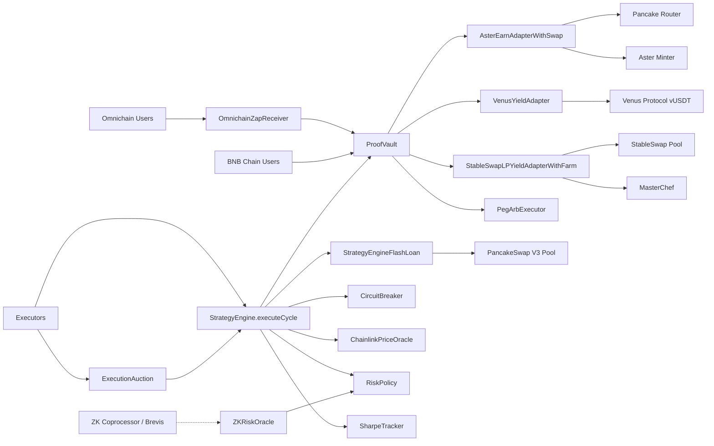
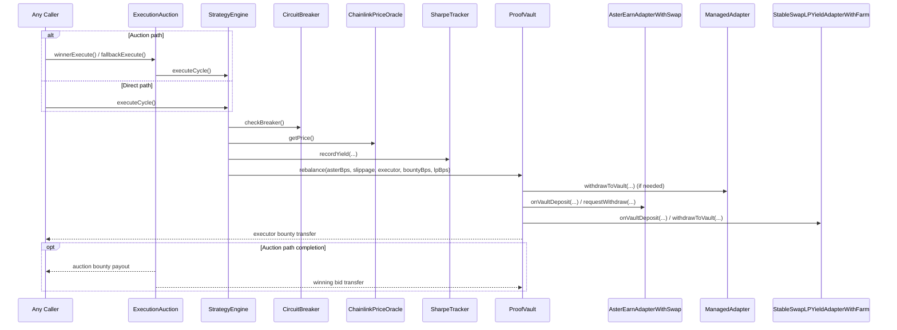

<p align="center">
  
  <br /><br />
  
  
</p>

# AsterPilot ProofVault

Autonomous, non-custodial yield routing stack on BNB Chain.

This README is updated to the current deployed V3 institutional architecture (3-rail vault + risk engine + execution auction + omnichain routing).

## What This System Is

AsterPilot ProofVault is an ERC-4626 vault that routes USDT across three rails under a permissionless execution model:

1. Primary rail: `AsterEarnAdapterWithSwap` (USDT -> USDF swap, then async Aster minter integration).
2. Secondary rail (Buffer): `VenusYieldAdapter` (Idle USDT is routed to Venus Protocol vUSDT for 100% capital efficiency).
3. LP rail: `StableSwapLPYieldAdapterWithFarm` (StableSwap LP + MasterChef farm + CAKE harvest).

Core policy and safety are on-chain:

- `StrategyEngine` computes state and target allocations, utilizing `StrategyEngineFlashLoan` to execute atomic regime shifts via PancakeSwap V3 flash callbacks (eliminating idle capital and double-slippage).
- `RiskPolicy` stores immutable thresholds/targets.
- `CircuitBreaker` auto-trips/recovers from three market signals.
- `SharpeTracker` records rolling risk-adjusted performance observations.
- `ZKRiskOracle` accepts cryptographically verified off-chain Monte Carlo simulations from ZK-Coprocessors (like Brevis or Axiom) to dynamically adjust Hysteresis bands.
- `ExecutionAuction` auctions rebalance rights and forwards bid revenue/bounties.
- `OmnichainZapReceiver` allows users on any Layer 2 (Arbitrum, Base, Optimism) to bridge and deposit into the BNB Chain vault in a single transaction via LayerZero/Stargate.
## Contract Architecture (Current)

| Contract | Role |
| --- | --- |
| `ProofVault` | ERC-4626 vault, liquidity manager, and rebalance executor (`onlyEngine`) |
| `StrategyEngine` | Permissionless `executeCycle()` decision engine |
| `StrategyEngineFlashLoan` | PancakeSwap V3 flash callback for atomic capital shifts between adapters |
| `AsterEarnAdapterWithSwap` | Primary Aster rail with USDT/USDF swap and async withdraw claims |
| `VenusYieldAdapter` | Secondary rail buffer adapter integrating Venus Protocol (`vUSDT`) |
| `StableSwapLPYieldAdapterWithFarm` | LP + farm rail, permissionless CAKE harvest path |
| `RiskPolicy` | Immutable risk and allocation parameters |
| `ChainlinkPriceOracle` | Chainlink wrapper with staleness/validity checks |
| `ZKRiskOracle` | ZK-Coprocessor endpoint for off-chain verified Monte Carlo risk bounds |
| `CircuitBreaker` | Triple-signal breaker (price deviation, reserve ratio, virtual price drawdown) |
| `SharpeTracker` | Rolling yield observations + Sharpe/Sortino calculations |
| `PegArbExecutor` | Permissionless peg-arb executor returning net profit to vault |
| `ExecutionAuction` | Rebalance Rights Auction overlay for `executeCycle()` |
| `OmnichainZapReceiver` | Cross-chain intent gateway via Stargate/LayerZero |
## Mermaid: System Topology



## Mermaid: Rebalance Execution Flow



## Latest Mainnet Deployment (BNB Chain, Chain ID 56)

### Core

| Contract | Address |
| --- | --- |
| `ProofVault` | `0xdE1FBFc6a334e848152c4F938A2Ac2eeB0f6590b` |
| `StrategyEngine` | `0x6570E79bC9dbe8e7EfbF929f3D877065293cd891` |
| `RiskPolicy` | `0xE5675Db6eb5806F2c32FE905D8bbD609F5C417e1` |
| `ChainlinkPriceOracle` | `0xFE5A18b7a330205dA6778cEa4536D642b4e772fF` |
| `CircuitBreaker` | `0x65079A226a23f3F7786aa7FB231f84FB81CB43B3` |
| `SharpeTracker` | `0x9953510D913e1D844a175404C9E7c49A8C163bEc` |

### Adapters and Executors

| Contract | Address |
| --- | --- |
| `AsterEarnAdapterWithSwap` | `0x2E96DA33D701cAAEfb34d491A2c4D42f39C2529F` |
| `ManagedAdapter` | `0x5B752e0D04A8C7e7ca26290EA2dEFA61be814C51` |
| `StableSwapLPYieldAdapterWithFarm` | `0x084Ad2C0D1254Cdd955FaFd9eC5b16D079D71df9` |
| `PegArbExecutor` | `0xA624EB4aC7A70eFf7DBADe603fb9d6bbd345954B` |
| `ExecutionAuction` | `0xf953624C4b2EB2300454EdaC9B548879F6cFEeB6` |

### Key Integration Addresses

- USDT: `0x55d398326f99059fF775485246999027B3197955`
- USDF: `0xc271fc70dd9e678a6a43a982f436e12d4a63c0a5`
- StableSwap Pool: `0x176f274335c8B5fD5Ec5e8274d0cf36b08E44A57`
- Pancake Router: `0x10ED43C718714eb63d5aA57B78B54704E256024E`
- MasterChef: `0x556B9306565093C855AEA9AE92A594704c2Cd59e`
- CAKE: `0x0E09FaBB73Bd3Ade0a17ECC321fD13a19e81cE82`

## Recent Fix Included in This Architecture

`AsterEarnAdapterWithSwap` claim path is now aligned with vault liquidity expectations:

- `claimAllMatured()` is `onlyVault`.
- Matured USDF claims are swapped back to USDT.
- Swapped USDT is transferred back to vault.
- `managedAssets()` includes idle input/output balances so accounting reflects claim/swap states.

## Repo Layout

```text
contracts/
├── ProofVault.sol
├── StrategyEngine.sol
├── RiskPolicy.sol
├── ChainlinkPriceOracle.sol
├── CircuitBreaker.sol
├── SharpeTracker.sol
├── AsterEarnAdapterWithSwap.sol
├── ManagedAdapter.sol
├── StableSwapLPYieldAdapterWithFarm.sol
├── PegArbExecutor.sol
├── ExecutionAuction.sol
└── interfaces/

scripts/
├── deployFullStackWithFarm.js
├── deployExecutionAuction.js
├── deployFullStackWithLpRail.js
├── deployFullStack.js
└── ...

frontend/
└── lib/contractAddresses.js
```

## Development

### Install and Test

```bash
npm install
npx hardhat compile
npx hardhat test
```

### Deploy Full Stack (Mainnet)

```bash
# requires V2_* env vars for core + farm params
npx hardhat run scripts/deployFullStackWithFarm.js --network bnb
```

### Deploy ExecutionAuction (against deployed vault/engine)

```bash
V2_ENGINE_ADDRESS=<engine> \
V2_VAULT_ADDRESS=<vault> \
V2_ASSET_ADDRESS=0x55d398326f99059fF775485246999027B3197955 \
npx hardhat run scripts/deployExecutionAuction.js --network bnb
```

### Frontend Address Source

`frontend/lib/contractAddresses.js` is the canonical frontend mapping for V2 addresses.

## Security Posture

- Ownership is renounced after configuration lock on vault/adapters.
- Reentrancy protection on state-changing paths where required.
- Slippage checks enforced on rebalance.
- Oracle staleness and price validity checks enforced.
- Circuit breaker can block execution under stressed market signals.
