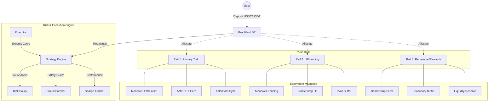

<p align="center">
  
  <br /><br />
  
  
  
</p>

# AsterPilot ProofVault: Multi-Chain Liquidity Hub

**The autonomous, cross-chain yield layer for the next generation of finance.**

AsterPilot ProofVault is a non-custodial capital routing stack that automates liquidity management across four critical ecosystems: **Polkadot Hub**, **BNB Chain**, **Aster (Astherus)**, and **Creditcoin (CTC)**. It acts as an intelligent "yield autopilot," moving assets between RWA loan fulfillment, stablecoin yield protocols, and decentralized exchange liquidity pools based on real-time risk signals.

---

## 🌐 Network Support Matrix

| Ecosystem | Primary Role | Target Network | Status |
| :--- | :--- | :--- | :--- |
| **Polkadot Hub** | Native Interop Hub | Paseo Asset Hub | **Verified & Secure** |
| **BNB Chain** | High-Yield Growth Rail | BNB Smart Chain | **Mainnet Live** |
| **Aster (Astherus)** | Native USDF Yield | AstherLayer (Upcoming) | **Integrated** |
| **Creditcoin (CTC)** | RWA Loan Fulfillment | Creditcoin L1 (Hella) | **Testnet Ready** |

---

## 📊 System Architecture

The vault employs a sophisticated **3-Rail Strategy** governed by an autonomous on-chain risk engine.



---

## 🛠️ Getting Started: Full Lifecycle

### 1. Installation & Environment
```bash
# Install dependencies
npm install

# Setup environment variables
cp .env.example .env
# Edit .env: 
# PRIVATE_KEY=<your_wallet_key>
# RPC URLs for bnbTestnet, creditcoinTestnet, polkadotHubTestnet
```

### 2. Deploy Full Stack
Deploy the core contracts and mock dependencies for your target network.

- **BNB Chain (Testnet)**:
  ```bash
  npx hardhat run scripts/DeployTestnetFullStackWithMocks.js --network bnbTestnet
  ```
- **Creditcoin (Hella)**:
  ```bash
  npx hardhat run scripts/DeployCreditcoinTestnetStack.js --network creditcoinTestnet
  ```
- **Polkadot Hub (Paseo)**:
  ```bash
  npx hardhat run scripts/DeployPolkadotHubFullStack.js --network polkadotHubTestnet
  ```

### 3. Seeding & Initialization (Full Flow)
To test the "Full Flow" (Deposit -> Rebalance -> Harvest), you must ensure mock protocols have liquidity and the vault has assets.

**A. Clear Circuit Breaker Signal A (Stale Feed)**
Testnet feeds are often stale. Run this to refresh timestamps and unblock execution:
```bash
npx hardhat run scripts/RefreshTestnetMockFeeds.js --network <network>
```

**B. Seed Vault Assets**
Mint mock USDT/USDC and deposit into the vault:
```bash
npx hardhat run scripts/SeedTestnetVaultDeposit.js --network <network>
```

### 4. Verification & Rebalance
Execute the first rebalance cycle to move assets from Idle into the 3-Rail strategy:
```bash
# For Polkadot Hub:
npx hardhat run scripts/VerifyPolkadotHubStack.js --network polkadotHubTestnet

# For other networks, use standard test suite:
npx hardhat test
```

---

## 📍 Deployed Addresses (Reference)

### Polkadot Hub (Paseo Asset Hub)
- **Chain ID:** `420420417` | **USDC (6 Decimals)**
- **Explorer:** [Paseo Moonscan](https://paseo.moonscan.io)
- **Network Dashboard:** [View on Polkadot-JS Apps](https://polkadot.js.org/apps/?rpc=wss%3A%2F%2Fpaseo.api.polkadot.io#/explorer)

| Contract | Address |
| :--- | :--- |
| `ProofVault` | `0x071958E16A54E3a963d17FdeEf2e6938CB8fbB10` |
| `StrategyEngine` | `0x4dDf07b881Bd0B7cc93deB9D2a7A3c5a6cE094ba` |
| `MoonwellERC4626Adapter` | `0x4695ef4ADE0D065C8901870876e75fE7b13210E3` |
| `MoonwellLendingAdapter` | `0x76505B830098302e94906Bd5a77B89569bCc7498` |
| `BeamSwapFarmAdapter` | `0x198E9ECfaA22d8385c386038e810788c9a358c74` |

### BNB Chain (Mainnet)
- **Chain ID:** `56` | **USDT (18 Decimals)**

| Contract | Address |
| :--- | :--- |
| `ProofVault` | `0x377ca215D07794C904e6B000B25B11934FE5d2f1` |
| `StrategyEngine` | `0xa2c09C35F91E181e20872706597Ef1E333BB8A1f` |
| `AsterEarnAdapter` | `0x477be4B8485fA3a56Ca7eE6d025A6bDBea1Be35c` |

### Creditcoin (Hella Testnet)
- **Chain ID:** `102031` | **USDT (18 Decimals)**

| Contract | Address |
| :--- | :--- |
| `ProofVault` | `0x7c30B24B91Cd9923d565239fA517F3C06371E196` |
| `StrategyEngine` | `0x3036840C588a51Fe77C4E38a838e5451b1b896Ae` |

---

## 🛡️ Security Posture

- **Ownership Renounced**: Configuration locked post-deployment.
- **Reentrancy Protected**: All state-changing functions fortified with guards.
- **Audit Verified**: Optimized for multi-chain gas mechanics and asset scaling.
- **ZK Ready**: Architectural hooks for ZK-verified risk metric submission.
