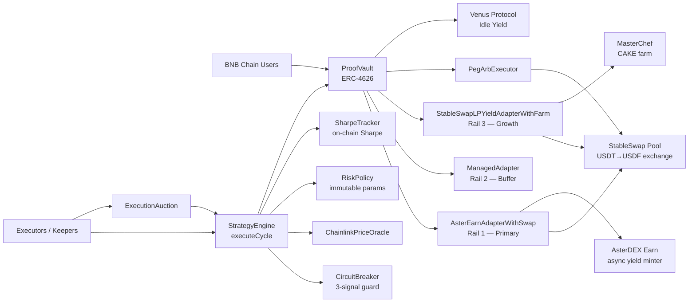

<p align="center">
  
  <br /><br />
  
  
</p>

# AsterPilot ProofVault

Autonomous, non-custodial yield routing stack on BNB Chain.

**🚀 Live dApp:** [https://asterpilot-proofvault.vercel.app](https://asterpilot-proofvault.vercel.app)

This README reflects the current deployed institutional architecture (3-rail vault + risk engine + execution auction + omnichain routing).

## Philosophy of Design

### Why this system was designed this way

The core insight behind AsterPilot ProofVault is that human capital managers fail at exactly the moments when precision matters most: during volatility spikes, peg deviations, and liquidity crunches. They sleep, they hesitate, and they pay for the privilege of being slow. This system removes the human from the loop entirely — not as a convenience feature, but as a first principle.

The design starts from a simple question: **if the smart contract is always awake, always deterministic, and can see every on-chain signal, why would you ever trust a human to press a button?**

### Core strategy and execution logic

The system operates as a three-rail capital routing engine governed by a risk state machine:

**Rail 1 — AsterDEX Earn (Primary):** USDT is swapped to USDF and deposited into AsterDEX Earn as the primary yield source and capital anchor. In distress conditions, allocation to Aster _increases_ (from `normalAsterBps` to `drawdownAsterBps`) because AsterDEX Earn is the most stable, protocol-native yield source when external LP markets are stressed.

**Rail 2 — Managed Secondary (Buffer):** Capital not deployed to Rail 1 or Rail 3 is held in the `ManagedAdapter`. This serves as the primary liquidity reserve for withdrawals and slippage absorption.

**Idle Buffer — Venus Protocol:** Capital sitting raw in the vault contract (the idle buffer) earns passive yield via Venus vUSDT. There is no idle capital — even the buffer works. This is not a fallback; it is the baseline.

**Rail 3 — PancakeSwap StableSwap LP + MasterChef (Growth):** LP allocation is highest in `Normal` state and retreats to zero in `Drawdown`. CAKE rewards are auto-harvested and compounded back into the vault. _Note: Currently inactive on Mainnet._

**Risk state machine:** The engine computes EWMA (exponentially-weighted moving average) volatility each cycle, classifies market conditions into three states (Normal / Guarded / Drawdown), and adjusts rail allocations atomically. Hysteresis bands prevent regime thrashing on marginal price movements.

**Execution model:** `executeCycle()` is fully permissionless — any address can call it. A Dutch auction bounty mechanism (linear escalation from `minBountyBps` to `maxBountyBps`) creates a MEV-like incentive structure so that competitive searchers time execution optimally.

**Flash loan regime shifts:** When risk state changes, `executeCycleWithFlashRebalance()` uses a PancakeSwap V3 flash callback to atomically shift capital between adapters in a single transaction — eliminating double-slippage and idle capital windows.

**Peg arbitrage:** `PegArbExecutor` monitors the USDF/USDT pool for peg deviation and executes atomic arb (buy cheap USDF → redeem at par, or mint USDF at par → sell expensive) returning net profit to the vault.

### Key assumptions that were questioned or challenged

1. **"Rebalancers should be compensated by the vault."** We inverted this. In the `ExecutionAuction` model, rebalancers _pay_ for execution rights because they capture MEV from optimal block timing. The vault benefits, not just the executor.
2. **"A circuit breaker needs an admin to trip and reset it."** Ours is fully autonomous — it trips on any single signal (Chainlink USDT/USD deviation, StableSwap reserve ratio imbalance, virtual price drawdown) and recovers automatically after a cooldown when all signals clear.
3. **"Higher volatility = lower Aster allocation."** We challenged this. Under drawdown conditions, Aster allocation _increases_ because it is the most protocol-native, stable yield primitive. LP exposure (the most volatile) is reduced to near-zero. AsterDEX Earn functions as a hedge, not just a yield source.
4. **"Sharpe ratio requires off-chain analytics."** We compute rolling Sharpe and Sortino ratios on-chain using a circular buffer (O(1) writes), Bessel-corrected sample variance, and Babylonian integer square root.
5. **"Non-custodial means no admin can do anything."** Correct — after `lockConfiguration()` is called, ownership is irrevocably renounced on every contract that touches user funds. The system is governed by code, not keys.

---

## What This System Is

AsterPilot ProofVault is an ERC-4626 vault that routes USDT across three rails under a permissionless execution model:

1. **Primary rail — `AsterEarnAdapterWithSwap`:** USDT is swapped to USDF via the StableSwap pool (`exchange(0→1)`), then deposited into AsterDEX Earn as async yield. Claims are batched and swapped back to USDT on withdrawal.
2. **Secondary rail — `ManagedAdapter`:** Secondary liquidity reserve.
3. **LP rail — `StableSwapLPYieldAdapterWithFarm`:** USDT added as single-sided liquidity to the USDF/USDT StableSwap pool, LP tokens staked in MasterChef, and CAKE rewards compounded back to USDT.

Core policy and safety are on-chain:

- `StrategyEngine`: Computes state and triggers `vault.rebalance()`.
- `RiskPolicy`: Stores immutable thresholds and allocation targets.
- `CircuitBreaker`: Triple-signal autonomous breaker and auto-recovery.
- `SharpeTracker`: Rolling on-chain Sharpe/Sortino ratios.
- `ExecutionAuction`: Executors pay the vault for the right to call `executeCycle()`.
- `PegArbExecutor`: Executes peg-restoration arbitrage for vault profit.

## Contract Architecture (Deployed)

| Contract                           | Role                                                                     |
| ---------------------------------- | ------------------------------------------------------------------------ |
| `ProofVault`                       | ERC-4626 vault, liquidity manager, rebalance executor (`onlyEngine`)     |
| `StrategyEngine`                   | Permissionless `executeCycle()` — computes state, triggers rebalance     |
| `AsterEarnAdapterWithSwap`         | Rail 1: USDT→USDF via StableSwap, async deposit/claim into AsterDEX Earn |
| `ManagedAdapter`                   | Rail 2: Secondary liquidity buffer                                       |
| `StableSwapLPYieldAdapterWithFarm` | Rail 3: StableSwap LP + MasterChef farm + CAKE harvest                   |
| `RiskPolicy`                       | Immutable risk thresholds and rail allocation targets                    |
| `ChainlinkPriceOracle`             | Chainlink USDT/USD feed wrapper with staleness checks                    |
| `CircuitBreaker`                   | Triple-signal breaker (price, reserve ratio, virtual price)              |
| `SharpeTracker`                    | On-chain rolling Sharpe/Sortino via circular buffer                      |
| `PegArbExecutor`                   | Permissionless peg-arb: USDT/USDF arbitrage                              |
| `ExecutionAuction`                 | Rebalance Rights Auction — executors pay vault for execution rights      |

## Mermaid: System Topology



## Deployed Addresses

### Mainnet (BNB Chain, Chain ID 56)

| Contract                     | Address                                                                                                                |
| ---------------------------- | ---------------------------------------------------------------------------------------------------------------------- |
| `ProofVault`                 | [`0x377ca215D07794C904e6B000B25B11934FE5d2f1`](https://bscscan.com/address/0x377ca215D07794C904e6B000B25B11934FE5d2f1) |
| `StrategyEngine`             | [`0xa2c09C35F91E181e20872706597Ef1E333BB8A1f`](https://bscscan.com/address/0xa2c09C35F91E181e20872706597Ef1E333BB8A1f) |
| `RiskPolicy`                 | [`0xE15296aB11d75A093A18a7912ad5F93Bc6313cdB`](https://bscscan.com/address/0xE15296aB11d75A093A18a7912ad5F93Bc6313cdB) |
| `ChainlinkPriceOracle`       | [`0x9ab6c0997f2CEEA4e9f97053573722FDB3d58C5c`](https://bscscan.com/address/0x9ab6c0997f2CEEA4e9f97053573722FDB3d58C5c) |
| `CircuitBreaker`             | [`0x8f2e3c9B29ebc89785101e8f291b299f5e04d65B`](https://bscscan.com/address/0x8f2e3c9B29ebc89785101e8f291b299f5e04d65B) |
| `SharpeTracker`              | [`0x6520D0366A43081008049CdD4c87Db3A5ec203B8`](https://bscscan.com/address/0x6520D0366A43081008049CdD4c87Db3A5ec203B8) |
| `AsterEarnAdapter`           | [`0x477be4B8485fA3a56Ca7eE6d025A6bDBea1Be35c`](https://bscscan.com/address/0x477be4B8485fA3a56Ca7eE6d025A6bDBea1Be35c) |
| `ManagedAdapter` (secondary) | [`0x0E16c32De0272B24E1064C3F069F6b9AE4a13254`](https://bscscan.com/address/0x0E16c32De0272B24E1064C3F069F6b9AE4a13254) |
| `PegArbExecutor`             | [`0x16D0b61daF75C955784BE0ff9B484F3a095b1408`](https://bscscan.com/address/0x16D0b61daF75C955784BE0ff9B484F3a095b1408) |
| `ExecutionAuction`           | [`0x6f7ba78e3916AAC9e158E266c786dFbBa99FAa24`](https://bscscan.com/address/0x6f7ba78e3916AAC9e158E266c786dFbBa99FAa24) |

#### Key Integration Addresses

- USDT: [`0x55d398326f99059fF775485246999027B3197955`](https://bscscan.com/address/0x55d398326f99059fF775485246999027B3197955)
- USDF (Astherus USDF): [`0x5A110fC00474038f6c02E89C707D638602EA44B5`](https://bscscan.com/address/0x5A110fC00474038f6c02E89C707D638602EA44B5)
- StableSwap Pool: [`0x176f274335c8B5fD5Ec5e8274d0cf36b08E44A57`](https://bscscan.com/address/0x176f274335c8B5fD5Ec5e8274d0cf36b08E44A57)
- MasterChef V2: [`0x556B9306565093C855AEA9AE92A594704c2Cd59e`](https://bscscan.com/address/0x556B9306565093C855AEA9AE92A594704c2Cd59e)

### Testnet (BNB Chain Testnet, Chain ID 97)

| Contract                     | Address                                                                                                                        |
| ---------------------------- | ------------------------------------------------------------------------------------------------------------------------------ |
| `ProofVault`                 | [`0xA7207caCEA25b8a9BFf289C8aCCcD257C862314D`](https://testnet.bscscan.com/address/0xA7207caCEA25b8a9BFf289C8aCCcD257C862314D) |
| `StrategyEngine`             | [`0x6518CFAf53C39D6127723D67402e63E636Dd1c3E`](https://testnet.bscscan.com/address/0x6518CFAf53C39D6127723D67402e63E636Dd1c3E) |
| `RiskPolicy`                 | [`0x55D9BCB9F13Ca2d5aD3345E60234E48e6A719133`](https://testnet.bscscan.com/address/0x55D9BCB9F13Ca2d5aD3345E60234E48e6A719133) |
| `CircuitBreaker`             | [`0xfB5D6f83b1a5c42dFCd3fFAF76d0eF0d5ae5cB66`](https://testnet.bscscan.com/address/0xfB5D6f83b1a5c42dFCd3fFAF76d0eF0d5ae5cB66) |
| `SharpeTracker`              | [`0xe4eB72e5d29AA868948F2a691255BAAFf4A8b479`](https://testnet.bscscan.com/address/0xe4eB72e5d29AA868948F2a691255BAAFf4A8b479) |
| `AsterEarnAdapterWithSwap`   | [`0x096148CE528701614dF518B217A430A88635d561`](https://testnet.bscscan.com/address/0x096148CE528701614dF518B217A430A88635d561) |
| `ManagedAdapter` (secondary) | [`0x30d4F9f3e98BadD935872b03F64Bdb4F7AaE8628`](https://testnet.bscscan.com/address/0x30d4F9f3e98BadD935872b03F64Bdb4F7AaE8628) |
| `PegArbExecutor`             | [`0xeE5Fd164378Dca028586ef4C72e633A7b248dC1c`](https://testnet.bscscan.com/address/0xeE5Fd164378Dca028586ef4C72e633A7b248dC1c) |
| `ExecutionAuction`           | [`0x9e5763A7C11DB894A6aA1164cFDc849F9243751B`](https://testnet.bscscan.com/address/0x9e5763A7C11DB894A6aA1164cFDc849F9243751B) |

## Network Mode (Feature Flag)

The network is controlled at build/deploy time via environment variables in the frontend.

### Switch to Testnet

```bash
# frontend/.env
VITE_DEFAULT_NETWORK=testnet
```

### Switch to Mainnet (default)

```bash
# frontend/.env
VITE_DEFAULT_NETWORK=mainnet
```

## Vault Configuration Lock

Deposits are blocked until an admin calls `lockConfiguration()` on the vault contract. This operation freezes the adapter/engine configuration and enables the `deposit()` function.

## Repo Layout

```text
contracts/
├── ProofVault.sol
├── StrategyEngine.sol
├── RiskPolicy.sol
├── ChainlinkPriceOracle.sol
├── CircuitBreaker.sol
├── SharpeTracker.sol
├── AsterEarnAdapterWithSwap.sol
├── ManagedAdapter.sol
├── StableSwapLPYieldAdapterWithFarm.sol
├── PegArbExecutor.sol
├── ExecutionAuction.sol
└── interfaces/

scripts/
├── DeployMainnetFullStack.js
├── DeployTestnetFullStackWithMocks.js
├── DeployExecutionAuction.js
├── FullFlowMainnetSmoke.js
├── FullFlowTestnetSmoke.js
└── ...

test/
├── ComprehensiveSmartContractTestSuite.test.js
├── ExecutionAuctionRraRebalanceRights.test.js
├── ProofVaultV2FarmIntegration.test.js
└── ...
```

## Development

### Install and Test

```bash
npm install
npx hardhat compile
npx hardhat test
```

### Deploy Full Stack (Mainnet)

```bash
npx hardhat run scripts/DeployMainnetFullStack.js --network bnb
```

### Smoke Tests

```bash
# Testnet
npx hardhat run scripts/FullFlowTestnetSmoke.js --network bnbTestnet

# Mainnet (Fork Simulation)
npx hardhat run scripts/FullFlowMainnetSmoke.js
```

## Security Posture

- Ownership renounced after configuration lock.
- Reentrancy protection on state-changing paths.
- Slippage checks enforced on rebalance.
- Triple-signal circuit breaker for market stress events.
